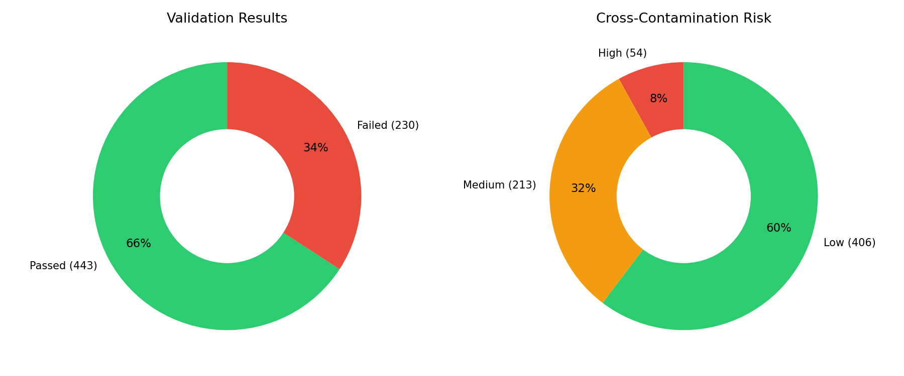
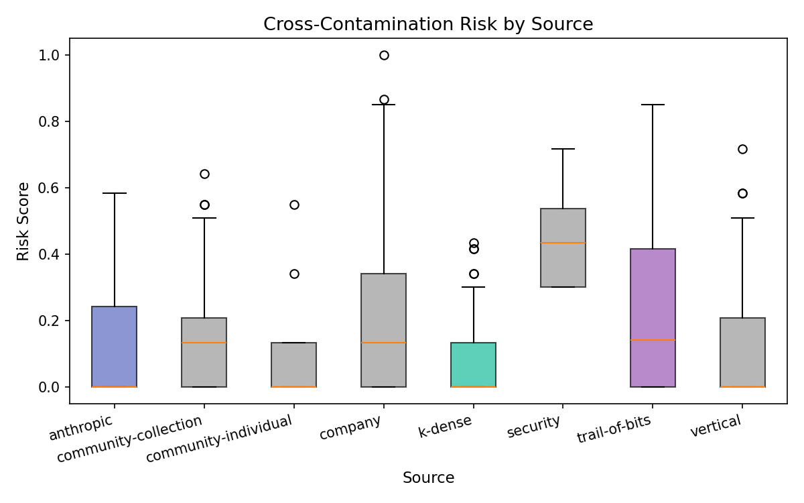

# Introduction

The emergence of AI coding agents — tools like Claude Code, GitHub Copilot, and Cursor — has shifted software development toward human-AI collaboration. These agents operate in agentic loops: they read code, plan modifications, write implementations, and run tests, with the human developer providing guidance and oversight.

Agent Skills [@agentskills-spec] extend this model by allowing developers and organizations to package domain expertise as modular instruction sets. A skill is a structured directory — primarily a `SKILL.md` markdown file plus optional reference materials — that an agent loads into its context window to gain specialized knowledge. Skills cover domains from specific tools (Playwright, Docker) to development methodologies (test-driven development, code review).

The Agent Skills ecosystem has grown rapidly. As of February 2026, the agentskills.io specification is supported by over 27 agent platforms including Claude Code, GitHub Copilot, Cursor, Windsurf, OpenAI Codex, and Gemini CLI. Companies from Microsoft and OpenAI to Stripe and Cloudflare publish official skills for their platforms. Community contributors have built skills for security analysis (Trail of Bits), scientific computing (K-Dense), and development workflows (Superpowers). We catalog 673 skills from 41 source repositories in our primary analysis, with an additional 800+ skills identified across the broader ecosystem.

However, this growth has outpaced quality assurance. No prior work has systematically evaluated skill quality. We identified three concerns:

1. **Structural compliance**: Many skills deviate from the specification, potentially confusing agents about which files to load and how to use them.
2. **Content quality**: Skills vary enormously in how clearly and specifically they instruct agents, from highly structured step-by-step guides to vague advisory text.
3. **Cross-contamination risk**: Skills for multi-interface tools (databases, cloud services, container runtimes) may include examples in one language that pollute the agent's behavior when generating code in another language.

This paper presents a systematic analysis across all three dimensions, using automated validation, content metrics, and cross-contamination detection. Our key contributions are:

- The first comprehensive structural audit of the Agent Skills ecosystem using the `skill-validator` tool [@skill-validator], covering 673 skills from 41 repositories
- Content quality metrics (information density, instruction specificity) applied at ecosystem scale
- Identification and taxonomy of cross-contamination risk in multi-interface skills
- An ecosystem survey cataloging 1,400+ skills across 120+ repositories, contextualizing our findings as industry-wide
- Concrete recommendations for skill authors and specification maintainers

# Methodology

## Dataset

We collected 673 skills from 41 source repositories, organized into eight analytical categories:

| Category | Skills | Repos | Description |
|----------|--------|-------|-------------|
| Anthropic | 16 | 1 | Official skills from the spec authors |
| Company | 288 | 22 | Skills published by companies for their own APIs/products |
| Community collections | 167 | 3 | Multi-skill community repositories |
| Community individual | 9 | 6 | Single-skill community repositories |
| Trail of Bits | 52 | 1 | Security-focused vulnerability analysis skills |
| K-Dense (Superpowers) | 48 | 3 | Development workflow and methodology skills |
| Security | 7 | 1 | Security tooling skills (Prompt Security) |
| Vertical | 86 | 4 | Domain-specific: legal, biotech, DevOps, embedded |

The company category includes skills from Microsoft (143), OpenAI (32), Sentry (16), HashiCorp (13), WordPress (13), Cloudflare (9), Expo (9), Hugging Face (9), Vue.js (8), Google (7), Better Auth (6), Vercel (5), Callstack (4), Tinybird (3), Neon (3), Black Forest Labs (2), Stripe (2), and others.

Each source repository is tracked as a git submodule pinned to a specific commit, ensuring reproducibility. Snapshot metadata (commit SHA, date, remote URL) is recorded for every source.

Skills were validated using `skill-validator` v1.0 [@skill-validator], a Go CLI tool that checks skills against the agentskills.io specification [@agentskills-spec].

## Structural Validation

Each skill was evaluated against the specification's requirements:

- **Structure**: Presence of `SKILL.md`, correct directory layout, no unexpected files
- **Frontmatter**: Valid YAML frontmatter with required fields (name, description, version)
- **Content**: Markdown body completeness and formatting
- **Token budget**: Total context window usage

The validator produces a pass/fail result per skill along with categorized errors and warnings.

## Content Analysis

We developed two automated content metrics:

**Information density** measures the proportion of a skill's content that consists of actionable material (code blocks and imperative sentences) versus prose. It is computed as:

$$\text{density} = 0.5 \times \frac{\text{code block words}}{\text{total words}} + 0.5 \times \frac{\text{imperative sentences}}{\text{total sentences}}$$

**Instruction specificity** measures the strength of a skill's language, based on the ratio of strong directive markers ("must", "always", "never", "ensure") to weak advisory markers ("may", "consider", "could", "possibly"):

$$\text{specificity} = \frac{\text{strong markers}}{\text{strong markers} + \text{weak markers}}$$

## Cross-Contamination Detection

Cross-contamination occurs when a skill designed for one context leaks information that corrupts agent behavior in another context. We developed a detection heuristic based on three factors:

1. **Multi-interface tool detection**: Does the skill reference a tool known to have multiple language SDKs (e.g., MongoDB, AWS, Docker)?
2. **Language mismatch**: Do code block languages differ from the skill's primary language category?
3. **Scope breadth**: How many distinct technology categories does the skill reference?

These factors combine into a risk score from 0 to 1, classified as low (< 0.2), medium (0.2–0.5), or high (≥ 0.5).

# Findings

## Structural Compliance

Of 673 skills evaluated, **443 (65.8%) passed** structural validation and **230 (34.2%) failed**.


Pass rates varied dramatically by source category:

| Category | Skills | Pass Rate | Errors | Warnings |
|----------|--------|-----------|--------|----------|
| Anthropic | 16 | 87.5% | 7 | 39 |
| Community collections | 167 | 87.4% | 45 | 209 |
| Trail of Bits | 52 | 76.9% | 21 | 77 |
| Vertical | 86 | 65.1% | 46 | 154 |
| Company | 288 | 57.6% | 189 | 542 |
| K-Dense | 48 | 35.4% | 65 | 117 |
| Community individual | 9 | 33.3% | 26 | 68 |
| Security | 7 | 14.3% | 6 | 23 |

A striking finding is that **company-published skills have a lower pass rate (57.6%) than community collections (87.4%)**. This inverts the common assumption that official company skills would be higher quality. The primary drivers:

- **Microsoft** (143 skills): Many skills use non-standard directory structures, placing skills under `.github/skills/` rather than the spec-standard layout. While functional within their GitHub Copilot integration, they generate structural validation errors.
- **Several companies** published skills before the spec was finalized and have not updated them to current requirements.

The K-Dense (Superpowers) skills had a low pass rate (35.4%), primarily because they use an alternative directory structure optimized for their development workflow rather than the agentskills.io specification.

Common errors across all sources included:
- Missing or malformed YAML frontmatter
- Unexpected files at the skill root (should be in `references/` or `assets/`)
- Missing required frontmatter fields

### Token Usage

Token counts varied by several orders of magnitude:


- Minimum: 0 tokens (empty skill placeholders)
- Maximum: 3,098,484 tokens (a scientific computing skill with large reference datasets)
- Median: 5,227 tokens
- Mean: 16,231 tokens

Company-published skills tend to be more concise (average 6,749 tokens) than community collections (21,349 tokens). The most focused skills — from Anthropic (8,189 avg) and K-Dense (3,592 avg) — demonstrate that effective skills can be compact.

## Content Quality


Content quality metrics revealed significant variation:

- **Information density**: Mean 0.200 (range 0.0–0.56). Most skills are prose-heavy with relatively few code examples or imperative instructions.
- **Instruction specificity**: Mean 0.621 (range 0.0–1.0). The expanded dataset shows a lower average specificity than our initial sample, driven by company skills that use more advisory language.

Anthropic skills cluster in the moderate-density, high-specificity quadrant — they are well-structured with clear directives but are not code-heavy. Company skills show the broadest distribution, ranging from highly specific API reference skills to vague best-practices guides.

## Cross-Contamination Risk



Our cross-contamination analysis identified:

- **54 high-risk skills** (8.0%) — significant potential for cross-language pollution
- **213 medium-risk skills** (31.7%) — some multi-language or multi-technology mixing
- **406 low-risk skills** (60.3%) — focused on a single technology or language



The security category had the highest average risk score (0.446), followed by Trail of Bits (0.239) and company-published skills (0.210). Security tools inherently operate across multiple languages and environments, making this expected. Company skills — particularly those for cloud platforms (Azure, AWS, Terraform) — scored higher because they often cover multiple language SDKs within a single skill.

### High-Risk Skills

The 54 high-risk skills cluster around three patterns:

1. **Multi-SDK platform skills**: Azure, AWS, and Terraform skills that cover multiple language bindings (Python, Java, TypeScript, .NET, Rust) within one skill
2. **Infrastructure-as-code skills**: Skills mixing shell commands, configuration languages (HCL, YAML), and application code
3. **Security analysis skills**: Tools that inherently operate across language boundaries

Key examples:
- **upgrade-stripe** (Stripe, risk: 1.0): Covers SDK upgrades across multiple languages with mixed code examples
- **provider-resources** (HashiCorp, risk: 0.85): Terraform provider development mixing Go, HCL, and shell
- **ossfuzz** (Trail of Bits, risk: 0.85): Combines Docker, shell, Python, and C/C++ for fuzz testing
- **monitoring-observability** (DevOps vertical, risk: 0.72): References AWS, Kubernetes, PostgreSQL, MySQL, and Elasticsearch

### Case Study: MongoDB Cross-Contamination

The cross-contamination risk is not theoretical. During development of this analysis, we observed a concrete case: a MongoDB skill containing `mongosh` (shell) examples caused Claude Code to generate incorrect Node.js driver code. The agent produced queries using shell syntax (`db.collection.find({})`) instead of the Node.js driver API (`collection.find({})`), and it embedded shell-specific operators in JavaScript contexts.

This occurs because the agent's context window merges the skill's shell examples with the user's Node.js project context. The shell examples are syntactically valid JavaScript (MongoDB's shell is JavaScript-based), making the contamination especially insidious — the generated code often *looks* correct but behaves incorrectly in a Node.js application.

## Company vs. Community: Quality Comparison

A key question motivating this expanded analysis was whether company-published skills demonstrate higher quality than community contributions. The answer is nuanced:

| Dimension | Company (288) | Community Collections (167) | Anthropic (16) |
|-----------|--------------|---------------------------|----------------|
| Pass rate | 57.6% | 87.4% | 87.5% |
| Avg tokens | 6,749 | 21,349 | 8,189 |
| Avg info density | 0.255 | 0.176 | 0.125 |
| Avg specificity | 0.585 | 0.598 | 0.725 |
| Avg risk score | 0.210 | 0.170 | 0.136 |

Companies produce more **informationally dense** skills (higher code-to-prose ratio) but score lower on **structural compliance** and **instruction specificity**. This suggests companies prioritize API reference content over the instructional framing that helps agents use the information effectively.

Anthropic's own skills, while small in number, set a benchmark for instruction specificity (0.725) — their skills use strong directive language that leaves less room for agent misinterpretation. Community collections fall between company and Anthropic skills on most dimensions.

## Metric Correlations


Notable correlations:
- Token count shows weak positive correlation with error count, suggesting larger skills tend to have more structural issues
- Information density and code block ratio are strongly correlated (by construction)
- Risk score correlates with warnings, as structurally complex skills tend to have broader technology scopes

# Recommendations for Skill Authors

Based on our findings, we recommend the following practices:

1. **Validate before publishing**: Run `skill-validator` on your skill and fix all errors. Currently, 34.2% of published skills fail basic validation — including 42% of company-published skills.

2. **Scope skills tightly**: Skills covering multi-interface tools should target a specific language SDK. A "MongoDB for Node.js" skill is safer than a generic "MongoDB" skill. We identified 54 high-risk skills where broad scope creates contamination potential.

3. **Label code blocks explicitly**: Always specify the language in fenced code blocks (` ```javascript ` rather than ` ``` `). This helps agents disambiguate code contexts.

4. **Use strong directive language**: Skills with higher instruction specificity (using "must", "always", "never") provide clearer guidance to agents. Company skills in particular tend toward advisory language ("consider", "might") where directive language would be more effective.

5. **Minimize token usage**: Keep skills focused. The median effective skill uses ~5,200 tokens. Skills exceeding 50,000 tokens likely include material that should be external references.

6. **Separate language-specific examples**: If a skill must cover multiple languages, use clearly delineated sections with explicit context-switching markers. Consider publishing separate skills per language SDK.

# Recommendations for Spec Maintainers

1. **Add a `languages` frontmatter field**: Skills should explicitly declare which programming languages they target. This enables agents to filter skills by context and would help mitigate cross-contamination.

2. **Define quality tiers**: Introduce a quality score based on structural compliance, content metrics, and contamination risk. Published skill registries could use these tiers for ranking.

3. **Require code block language annotations**: Make unlabeled code blocks a validation error, not just a warning. Language annotations are essential for preventing cross-contamination.

4. **Provide multi-language skill guidelines**: Publish guidance for skills that necessarily cover multiple languages (CI/CD, infrastructure, cross-platform tools). With 54 high-risk skills in our sample alone, this is an urgent need.

5. **Add contamination risk assessment**: Include cross-contamination detection in the specification's recommended validation pipeline.

6. **Engage company publishers**: Company-published skills have the lowest structural compliance rate (57.6%). Given their high visibility and adoption, bringing these into compliance would significantly improve ecosystem quality.

# Limitations and Future Work

**Limitations:**

- Our content metrics (information density, instruction specificity) are heuristic and may not capture all aspects of skill quality
- Cross-contamination risk scoring uses keyword matching rather than semantic analysis
- We analyze the skill text only, not the actual agent behavior when using skills
- The dataset represents a point-in-time snapshot; the ecosystem evolves rapidly
- Some skill name collisions occur across sources within the same category

**Future work:**

- **Behavioral testing**: Measure actual agent performance with and without skills across domains to validate contamination risk scores
- **LLM-as-judge quality scoring**: Use Claude to evaluate skill quality on dimensions like clarity, coherence, and actionability (infrastructure built, awaiting execution)
- **Longitudinal analysis**: Track skill quality trends as the ecosystem matures and companies update their skills
- **Skill composition analysis**: Study how multiple active skills interact and potentially conflict
- **Expanded coverage**: Our ecosystem survey (Appendix A) identifies 800+ additional skills; analyzing the full set would strengthen statistical power

# Conclusion

The Agent Skills ecosystem is young and growing rapidly. Our analysis of 673 skills from 41 repositories reveals meaningful variation in structural compliance (65.8% pass rate), content quality, and cross-contamination risk (54 high-risk skills). Perhaps the most striking finding is that company-published skills — from Microsoft, OpenAI, Stripe, and others — have a *lower* structural compliance rate (57.6%) than community collections (87%), inverting the assumption that official sources produce higher-quality skills.

The cross-contamination risk is not merely theoretical: multi-interface tool skills can actively degrade agent performance through cross-language pollution. With 8.0% of skills at high risk and the ecosystem growing rapidly (we estimate 1,400+ skills exist across 120+ repositories), this is an industry-scale concern.

Quality standards, validation tooling, and authoring guidelines can address these issues. As skills become a core part of the AI development workflow, the community benefits from treating them as first-class software artifacts deserving of the same quality discipline we apply to libraries and APIs.

\newpage

# Appendix A: Ecosystem Survey {.unnumbered}

Beyond the 673 skills we analyzed in depth, we conducted a broad survey of the Agent Skills ecosystem to estimate the total scope and identify patterns in adoption. This appendix documents our findings.

## Scale of the Ecosystem

As of February 2026, we identified **120+ repositories** containing Agent Skills, with an estimated **1,400+ individual skills** across the ecosystem. The agentskills.io specification is supported by **27+ agent platforms**.

Our analyzed sample of 673 skills represents approximately 48% of the estimated total. The quality patterns we observe — particularly the 34.2% structural failure rate and 8.0% high contamination risk — likely extend to the broader ecosystem.

## Adoption by Category

**Platform publishers** (3 repos, ~50 skills): Anthropic (16 skills), OpenAI (32 skills for Codex), Vercel (5 skills). These serve as reference implementations.

**Company-published** (22+ repos, ~300+ skills): The largest segment. Microsoft alone publishes 143 skills covering Azure SDKs across five languages. Other major publishers include Sentry (16), HashiCorp (13), WordPress (13), Expo (9), Hugging Face (9), Cloudflare (9), and Vue.js (8). Companies publish skills to reduce integration friction for developers using their products.

**Community collections** (10+ repos, ~400+ skills): Multi-skill repositories from community maintainers. K-Dense-AI publishes 145+ scientific computing skills. Anthony Fu maintains 17 skills for the Vue/Nuxt/Vite ecosystem. Obsidian's CEO publishes 5 skills for the knowledge management tool. The K-Dense/Superpowers family covers development methodology.

**Individual community skills** (60+ repos, ~100+ skills): Single-purpose skills covering niche use cases: D3.js visualization, Playwright testing, ffuf security scanning, Home Assistant automation, video editing, and more.

**Security-focused** (5+ repos, ~65+ skills): Trail of Bits (52+ skills) dominates this space with vulnerability scanning, fuzzing, and audit skills. Prompt Security (7 skills) and Cisco AI Defense provide security scanning skills. Snyk publishes an agent security scanner.

**Vertical/domain-specific** (10+ repos, ~100+ skills):

- *Legal* (lawvable): 38 skills for contract review, compliance, and legal document drafting
- *Biotech* (Adaptyv Bio): 21 skills for protein design, AlphaFold, and computational biology
- *Embedded/IoT* (Zephyr): 22 skills for RTOS development, BLE, and board bringup
- *DevOps*: 6 skills for Terraform, Kubernetes, CI/CD, and monitoring
- *Business strategy* (wondelai): 25 skills covering Blue Ocean Strategy, Design Sprint, and similar frameworks

## Ecosystem Infrastructure

Several supporting tools have emerged:

- **skills.sh**: Web registry with 58,000+ installations, providing search and discovery
- **Vercel `npx skills` CLI**: One-command installation of skills from any GitHub repository
- **SkillsMP**: Marketplace with quality indicators and category filtering
- **skill-validator** [@skill-validator]: Structural validation tool (used in this analysis)
- **Cisco AI Defense skill-scanner**: Security scanner for detecting malicious skill patterns
- **Snyk agent-scan**: Security scanner for AI agents and skills

## Implications for Our Findings

If the quality patterns we observe in our 673-skill sample hold across the full 1,400+ skill ecosystem:

- **~479 skills** may fail structural validation
- **~112 skills** may carry high cross-contamination risk
- **~444 skills** may carry medium contamination risk

These estimates underscore the urgency of quality standards and validation tooling. The ecosystem has reached a scale where manual review is impractical — automated quality gates are necessary.

## Source Repositories Not Included in Primary Analysis

For completeness, we list additional repositories identified during our survey that were not included in our primary analysis. These represent opportunities for future expansion:

- **OthmanAdi/planning-with-files** (13,888 stars): 13 planning workflow skills
- **blader/humanizer** (4,798 stars): AI text humanization
- **antfu/skills** (3,403 stars): Vue/Nuxt ecosystem (partially included)
- **blader/Claudeception** (1,624 stars): Autonomous skill extraction
- **CharlesWiltgen/Axiom** (465 stars): 144 Apple xOS development skills
- **daymade/claude-code-skills** (579 stars): 37 production-ready skills
- **Aaronontheweb/dotnet-skills** (327 stars): 33 .NET ecosystem skills
- **wondelai/skills** (104 stars): 25 business strategy skills
- **sundial-org/skills** (142 stars): 11 research-oriented skills
- Multiple awesome-lists curating 300-800+ skills each

# References
