# Introduction

The emergence of AI coding agents — tools like Claude Code, GitHub Copilot, and Cursor — has shifted software development toward human-AI collaboration. These agents operate in agentic loops: they read code, plan modifications, write implementations, and run tests, with the human developer providing guidance and oversight.

Agent Skills [@agentskills-spec] extend this model by allowing developers and organizations to package domain expertise as modular instruction sets. A skill is a structured directory — primarily a `SKILL.md` markdown file plus optional reference materials — that an agent loads into its context window to gain specialized knowledge. Skills cover domains from specific tools (Playwright, Docker) to development methodologies (test-driven development, code review).

The Agent Skills ecosystem has grown rapidly. As of February 2026, the agentskills.io specification is supported by over 27 agent platforms including Claude Code, GitHub Copilot, Cursor, Windsurf, OpenAI Codex, and Gemini CLI. Companies from Microsoft and OpenAI to Stripe and Cloudflare publish official skills for their platforms. Community contributors have built skills for security analysis (Trail of Bits), scientific computing (K-Dense), and development workflows (Superpowers). We catalog 673 skills from 41 source repositories in our primary analysis, with an additional 800+ skills identified across the broader ecosystem.

However, this growth has outpaced quality assurance. No prior work has systematically evaluated skill quality. We identified three concerns:

1. **Structural compliance**: Many skills deviate from the specification, potentially confusing agents about which files to load and how to use them.
2. **Content quality**: Skills vary enormously in how clearly and specifically they instruct agents, from highly structured step-by-step guides to vague advisory text.
3. **Cross-contamination risk**: Skills for multi-interface tools (databases, cloud services, container runtimes) may include examples in one language that interfere with the agent's code generation in another language — a concern supported by research on Programming Language Confusion [@moumoula2025plc], copy bias in in-context learning [@ali2024copybias], and the demonstrated susceptibility of LLMs to irrelevant context [@shi2023distracted].

This paper presents a systematic analysis across all three dimensions, using automated validation, content metrics, cross-contamination detection, and a controlled behavioral evaluation that tests whether structural risk predictions hold in practice. Our key contributions are:

- The first comprehensive structural audit of the Agent Skills ecosystem using the `skill-validator` tool [@skill-validator], covering 673 skills from 41 repositories, with a two-pass validation approach that separates deterministic structural checks from environment-dependent link validation
- Content quality metrics (information density, instruction specificity) applied at ecosystem scale
- Identification and taxonomy of cross-contamination risk in multi-interface skills, including the discovery of "hidden contamination" in reference files (66 skills with clean instruction files but contaminated references)
- A behavioral evaluation of 19 representative skills demonstrating that structural contamination scores do not predict behavioral degradation (r = 0.077), identifying six distinct content interference mechanisms, and finding that realistic agentic context mitigates roughly two-thirds of measured degradation
- A token budget composition analysis revealing that 52% of all tokens across the ecosystem are nonstandard files wasting context window space
- An ecosystem survey cataloging 1,400+ skills across 120+ repositories, contextualizing our findings as industry-wide
- Concrete recommendations for skill authors and specification maintainers

# Methodology

## Dataset

We collected 673 skills from 41 source repositories, organized into eight analytical categories:

| Category | Skills | Repos | Description |
|----------|--------|-------|-------------|
| Anthropic | 16 | 1 | Official skills from the spec authors |
| Company | 288 | 22 | Skills published by companies for their own APIs/products |
| Community collections | 167 | 3 | Multi-skill community repositories |
| Community individual | 9 | 6 | Single-skill community repositories |
| Trail of Bits | 52 | 1 | Security-focused vulnerability analysis skills |
| K-Dense (Superpowers) | 48 | 3 | Development workflow and methodology skills |
| Security | 7 | 1 | Security tooling skills (Prompt Security) |
| Vertical | 86 | 4 | Domain-specific: legal, biotech, DevOps, embedded |

The company category includes skills from Microsoft (143), OpenAI (32), Sentry (16), HashiCorp (13), WordPress (13), Cloudflare (9), Expo (9), Hugging Face (9), Vue.js (8), Google (7), Better Auth (6), Vercel (5), Callstack (4), Tinybird (3), Neon (3), Black Forest Labs (2), Stripe (2), and others.

Each source repository is tracked as a git submodule pinned to a specific commit, ensuring reproducibility. Snapshot metadata (commit SHA, date, remote URL) is recorded for every source.

Skills were validated using `skill-validator` v1.0 [@skill-validator], a Go CLI tool that checks skills against the agentskills.io specification [@agentskills-spec].

## Structural Validation

Each skill was evaluated against the specification's requirements:

- **Structure**: Presence of `SKILL.md`, correct directory layout, no unexpected files
- **Frontmatter**: Valid YAML frontmatter with required fields (name, description, version)
- **Content**: Markdown body completeness and formatting
- **Token budget**: Total context window usage

The validator produces a pass/fail result per skill along with categorized errors and warnings. We run the validator in two passes: first with structural checks only (`--only structure`), then with all other checks (`--skip structure`) for content analysis, contamination detection, and link validation. Link results are split into two categories: **internal links** (references to files within the skill directory, e.g. `references/api_guide.md`) are treated as structural failures since they indicate missing files, while **external links** (HTTP/HTTPS URLs) are reported separately as link health metadata. External URL validation is environment-dependent — URLs may be temporarily unreachable due to DNS failures, rate limiting, or transient outages — so excluding them from the pass/fail determination ensures reproducible structural compliance results across runs.

## Content Analysis

We developed two automated content metrics:

**Information density** measures the proportion of a skill's content that consists of actionable material (code blocks and imperative sentences) versus prose. It is computed as:

$$\text{density} = 0.5 \times \frac{\text{code block words}}{\text{total words}} + 0.5 \times \frac{\text{imperative sentences}}{\text{total sentences}}$$

**Instruction specificity** measures the strength of a skill's language, based on the ratio of strong directive markers ("must", "always", "never", "ensure") to weak advisory markers ("may", "consider", "could", "possibly"):

$$\text{specificity} = \frac{\text{strong markers}}{\text{strong markers} + \text{weak markers}}$$

## LLM-as-Judge Quality Scoring

To complement the heuristic content metrics, we employed an LLM-as-judge approach to evaluate skill quality across dimensions that resist automated measurement. The scoring uses a two-pass design:

**Pass 1 — SKILL.md scoring** evaluates each skill's primary instruction file on six dimensions (each scored 1–5): *clarity* (unambiguous instructions), *actionability* (step-by-step executability), *token efficiency* (conciseness), *scope discipline* (focus on stated purpose), *directive precision* (use of strong imperatives vs. vague suggestions), and *novelty* (information beyond LLM training data).

**Pass 2 — Reference file scoring** evaluates each reference file on five dimensions (each scored 1–5): *clarity*, *instructional value* (concrete examples and patterns), *token efficiency*, *novelty*, and *skill relevance* (alignment with the parent skill's purpose). The judge receives the parent skill's name and description as context.

Both passes use Claude Sonnet (claude-sonnet-4-5-20250929) with content truncated to 8,000 characters per document and results cached for reproducibility. Coverage is complete: all 673 skills were scored, along with 1,877 reference files across 411 skills. Three skills containing embedded AI-directed prompts caused persistent prompt interference with the judge model (see Limitations); these were scored manually.

## Cross-Contamination Detection

Cross-contamination occurs when a skill designed for one context leaks information that influences agent behavior in another context. Research has established that code LLMs exhibit "Programming Language Confusion" — systematically generating code in unintended languages despite explicit instructions, with strong defaults toward Python and shifts between syntactically similar language pairs [@moumoula2025plc]. LLMs also exhibit a "copy bias" where they replicate patterns from in-context examples rather than reasoning independently about the task [@ali2024copybias], and in-context code examples have been shown to bias the style and characteristics of generated code [@li2023lail]. These findings suggest that mixed-language code examples in skill files could induce cross-language interference.

We developed a detection heuristic to estimate cross-contamination risk based on three structural factors:

1. **Multi-interface tool detection**: Does the skill reference a tool known to have multiple language SDKs (e.g., MongoDB, AWS, Docker)?
2. **Language mismatch**: Do code block languages differ from the skill's primary language category? Mismatches are weighted by syntactic similarity: mixing application languages (e.g., Python and JavaScript) carries higher weight than mixing an application language with auxiliary languages (shell, config, markup), reflecting research showing that Programming Language Confusion occurs primarily between syntactically similar language pairs [@moumoula2025plc].
3. **Scope breadth**: How many distinct technology categories does the skill reference?

These factors combine into a risk score from 0 to 1, classified as low (< 0.2), medium (0.2–0.5), or high (≥ 0.5). This score measures the *structural* potential for cross-contamination based on the presence of mixed-language content. We validate this structural metric against measured behavioral impact in the Behavioral Validation subsection of Cross-Contamination Risk.

An important distinction underlies the scoring: the research literature supports two different mechanisms by which multi-language content can degrade code generation, with different risk profiles:

- **Language confusion** — the model generates code using patterns from the wrong language. Research shows this primarily affects syntactically similar language pairs (C#/Java, JavaScript/TypeScript) and is driven by syntactic overlap in training data [@moumoula2025plc]. Skills mixing multiple application-language SDKs (e.g., Python and JavaScript examples for the same API) carry the highest risk.
- **Context dilution** — additional content of any type consumes context window budget and reduces the model's attention to the user's actual task [@tian2024spa; @hong2025contextrot]. This affects all multi-language content equally, regardless of syntactic similarity, and is addressed separately in our token budget analysis.

Many skills in our dataset mix an application language with bash scripts, YAML configuration, or SQL queries — a common and often necessary pattern for infrastructure and DevOps skills. Our scoring weights these auxiliary-language mismatches lower than application-to-application mismatches, since the syntactic dissimilarity between (for example) bash and Python makes language confusion less likely than between Python and JavaScript.

## Behavioral Evaluation

To validate whether structural contamination risk predicts actual degradation in agent output, we conducted a controlled behavioral evaluation of 19 skills from our dataset (one skill, doc-coauthoring, was excluded from aggregates because it triggers behavioral override rather than contamination — the model follows the skill's collaborative workflow instead of generating code).

**Skill selection.** We sampled 20 skills spanning the contamination score range (0.00–0.93), all source categories, and multiple content types. For each skill, we designed five tasks spanning five interference categories: *direct target* (tasks the skill is designed to help with), *cross-language* (tasks in a different language than the skill's examples), *similar syntax* (tasks in a syntactically similar language), *grounded* (tasks with well-defined correct answers the model already handles well), and *adjacent domain* (tasks in a related but distinct domain).

**Conditions.** Each task was evaluated under three conditions, each run three times at temperature 0.3:

- **Baseline (A)**: The task prompt alone, with no skill content
- **With-skill (B)**: The task prompt preceded by the skill's SKILL.md and selectively loaded reference files
- **Realistic (D)**: The task prompt preceded by the skill content, a Claude Code system preamble, and simulated conversation history — approximating how skills are loaded in practice

For skills with large reference directories, we loaded 2–3 reference files per task (selected for relevance to each task's interference vector) rather than all references. This selective loading approach was motivated by a controlled experiment showing that loading all reference files for a large skill produces near-identical outputs across runs, effectively reducing n to 1 and masking real interference effects.

**Scoring.** Outputs were scored by an LLM judge (Claude Sonnet) on five dimensions (correctness, completeness, code quality, specificity, following instructions) plus deterministic pattern matching for task-specific contamination signals. The composite score (1–5 scale) was averaged across dimensions and runs. Statistical significance was assessed using Welch's t-test on per-run composite scores.

**Metrics.** The primary metric is the B-A delta: mean with-skill score minus mean baseline score, measuring skill-only interference. The D-A delta measures interference under realistic conditions. The mitigation ratio (D-A / B-A) captures how much realistic context attenuates the skill-only effect.

# Findings

## Structural Compliance

Of 673 skills evaluated, **525 (78.0%) passed** structural validation and **148 (22.0%) failed**. Structural validation includes internal link integrity (references to files within the skill directory) but excludes external URL checks, which are environment-dependent and reported separately (see Methodology).

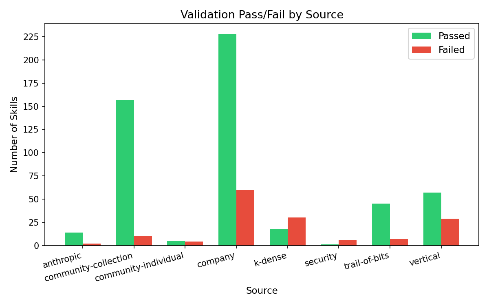

Pass rates varied dramatically by source category:

| Category | Skills | Pass Rate | Errors | Warnings |
|----------|--------|-----------|--------|----------|
| Community collections | 167 | 94.0% | 30 | 208 |
| Anthropic | 16 | 87.5% | 7 | 37 |
| Trail of Bits | 52 | 86.5% | 15 | 73 |
| Company | 288 | 79.2% | 96 | 464 |
| Vertical | 86 | 66.3% | 41 | 152 |
| Community individual | 9 | 55.6% | 7 | 68 |
| K-Dense | 48 | 37.5% | 62 | 116 |
| Security | 7 | 14.3% | 6 | 23 |

Community collections lead at 94.0%, followed by Anthropic (87.5%) and Trail of Bits (86.5%). **Company-published skills have a lower pass rate (79.2%) than community collections (94.0%)**, inverting the common assumption that official company skills would be higher quality. The primary drivers:

- **Microsoft** (143 skills): Many skills use non-standard directory structures, placing skills under `.github/skills/` rather than the spec-standard layout. While functional within their GitHub Copilot integration, they generate structural validation errors.
- **Several companies** published skills before the spec was finalized and have not updated them to current requirements.

The K-Dense (Superpowers) skills had a low pass rate (37.5%), primarily because they use an alternative directory structure optimized for their development workflow rather than the agentskills.io specification.

Common errors across all sources included:
- Missing or malformed YAML frontmatter
- Unexpected files at the skill root (should be in `references/` or `assets/`)
- Missing required frontmatter fields

### Token Usage

Token counts varied by several orders of magnitude:

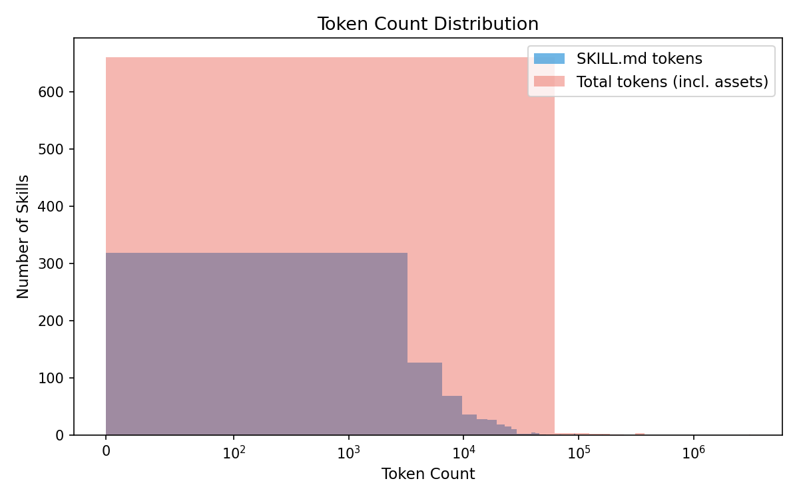

- Minimum: 0 tokens (empty skill placeholders)
- Maximum: 3,098,484 tokens (a scientific computing skill with large reference datasets)
- Median: 5,236 tokens
- Mean: 16,711 tokens

Company-published skills tend to be more concise (average 6,790 tokens) than community collections (22,900 tokens). The most focused skills — from Anthropic (8,189 avg) and K-Dense (3,592 avg) — demonstrate that effective skills can be compact.

### Token Budget Composition

Breaking total token counts into their constituent parts — SKILL.md body, reference files, asset files, and nonstandard files — reveals a striking pattern: **52% of all tokens across the ecosystem are nonstandard files** that fall outside the specification's defined structure.

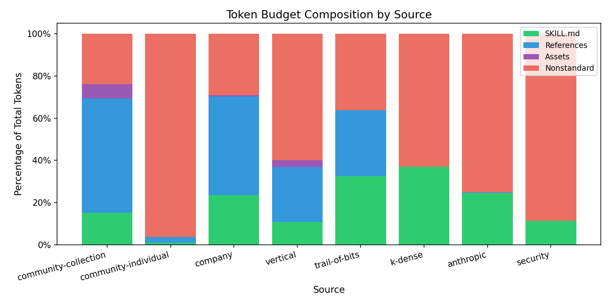

The agentskills.io specification defines three categories of skill content: the primary `SKILL.md` instruction file, supplementary `references/` files, and binary `assets/` files. Any file outside these categories (placed at the skill root or in non-standard directories) is loaded into the agent's context window but provides no instructional value — and research demonstrates that irrelevant context actively degrades LLM task performance [@shi2023distracted; @liu2024lost]. We term these **nonstandard tokens**.

| Category | SKILL.md | References | Assets | Nonstandard |
|----------|----------|------------|--------|-------------|
| Community collections | 15.2% | 54.1% | 6.8% | 23.9% |
| Community individual | 0.9% | 2.6% | 0.1% | 96.4% |
| Company | 23.5% | 46.9% | 0.6% | 29.1% |
| Vertical | 10.8% | 26.0% | 3.2% | 60.0% |
| Trail of Bits | 32.6% | 31.1% | 0.0% | 36.3% |
| K-Dense | 37.0% | 0.0% | 0.0% | 63.0% |
| Anthropic | 24.4% | 0.4% | 0.0% | 75.1% |
| Security | 11.4% | 0.0% | 0.0% | 88.6% |
| **Overall** | **13.1%** | **32.1%** | **2.9%** | **52.0%** |

Of 673 skills, 185 (27.5%) contain nonstandard files. The impact is substantial: the mean token count is inflated 108% by nonstandard files (mean effective tokens = 8,027 vs. mean total = 16,711). Even at the median, nonstandard files add 41% overhead.

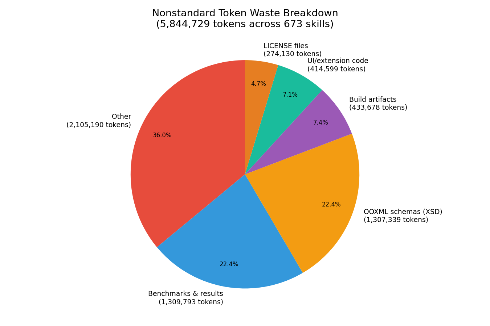

Analyzing the 5.8 million nonstandard tokens reveals several distinct categories of waste:

- **OOXML schemas** (1.3M tokens, 22.4%): Four document-processing skills (docx, pptx, and their Anthropic variants) ship raw ISO-IEC 29500-4 XML Schema Definition files. A single schema file (`sml.xsd`, the SpreadsheetML schema) consumes 298,868 tokens — larger than most entire skills.
- **Benchmarks and results** (1.3M tokens, 22.4%): One skill (loki-mode) includes SWE-bench evaluation results and prediction logs, consuming over 500k tokens of JSON benchmark data.
- **Build artifacts** (434k tokens, 7.4%): Source maps (`.js.map`), lockfiles (`package-lock.json`), and compiled presentations (`.pptx`) that are development artifacts, not instructional content.
- **LICENSE files** (274k tokens, 4.7%): 89 skills include LICENSE.txt files at the skill root. While legally appropriate, each consumes ~2,700 tokens of context window space that provides no value to the agent.
- **UI/extension code** (415k tokens, 7.1%): VS Code extension source code and dashboard HTML/JavaScript shipped alongside skills.

The practical consequence is significant. An agent loading one of these skills receives a context window filled with XML schemas, benchmark JSON, or license text instead of the user's code. Research on LLM agent trajectories has shown that 40–60% of input tokens in agentic systems can be classified as useless, redundant, or expired information that is safely removable without performance loss [@xiao2025agentdiet]. For the 82 skills where SKILL.md represents less than 10% of total tokens, the instruction file risks being drowned out by supplementary material — consistent with findings that LLM performance degrades when relevant information is surrounded by irrelevant context [@liu2024lost; @shi2023distracted].

Notably, even Anthropic's own skills — the reference implementation from the spec authors — have the highest percentage of nonstandard tokens (75.1%) of any source category, driven primarily by LICENSE.txt files and template directories. This suggests the problem is structural rather than a matter of author diligence: the specification does not currently warn against or penalize nonstandard files, so authors have no signal that these files consume context window budget.

## Content Quality

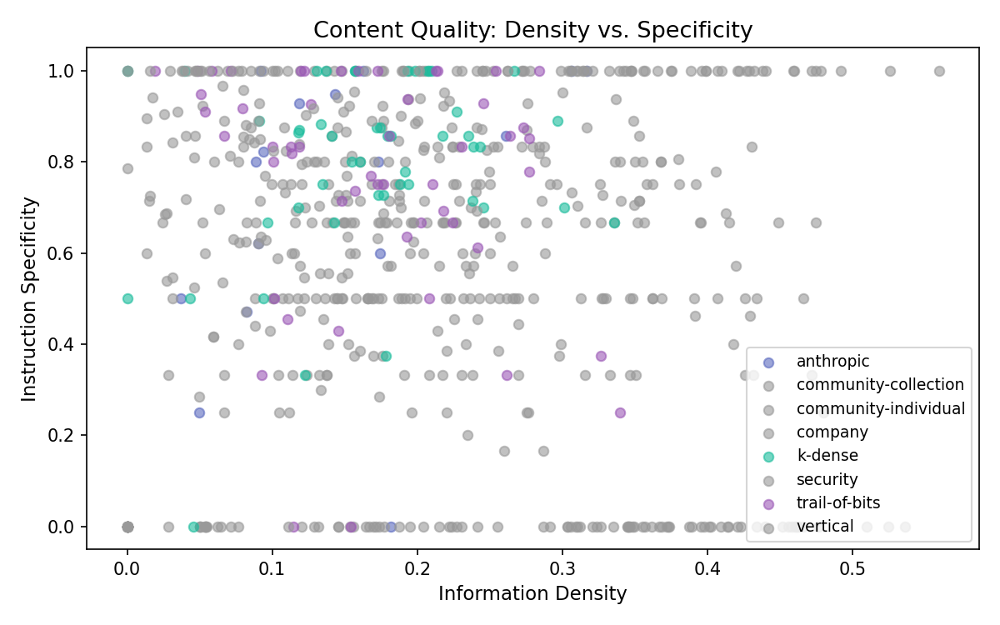

Content quality metrics revealed significant variation:

- **Information density**: Mean 0.206 (range 0.0–0.56). Most skills are prose-heavy with relatively few code examples or imperative instructions.
- **Instruction specificity**: Mean 0.616 (range 0.0–1.0). The expanded dataset shows a lower average specificity than our initial sample, driven by company skills that use more advisory language.

Anthropic skills cluster in the moderate-density, high-specificity quadrant — they are well-structured with clear directives but are not code-heavy. Company skills show the broadest distribution, ranging from highly specific API reference skills to vague best-practices guides.

### LLM-as-Judge Quality Assessment

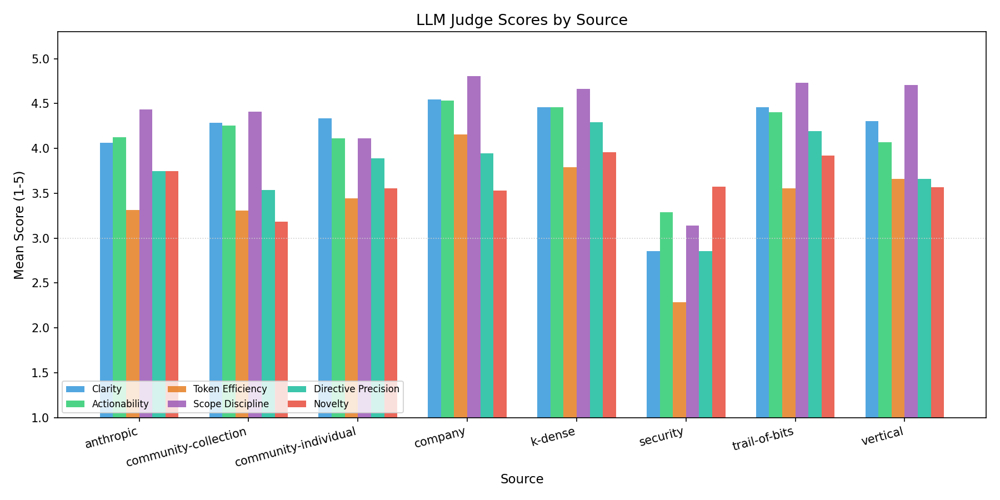

LLM-as-judge scoring reveals a more nuanced picture of quality than heuristic metrics alone. Across all 673 skills, the global dimension means are: clarity 4.41, actionability 4.36, token efficiency 3.76, scope discipline 4.64, directive precision 3.84, and novelty 3.52. Skills are generally clear and well-scoped but often verbose and redundant with training data — token efficiency and novelty are consistently the weakest dimensions.

Source rankings by overall LLM score diverge from structural compliance rankings: K-Dense leads (4.27), followed by company (4.25), Trail of Bits (4.21), vertical (4.00), community individual (3.91), Anthropic (3.91), community collections (3.83), and security (3.00). Anthropic's ranking at #6 is notable — while their skills set the benchmark for instruction specificity (0.725), several experimental and template-like skills pull down the LLM average. The security category scores lowest, driven by skills with incomplete or scaffold-like content.

Structural validation is largely orthogonal to LLM-judged quality: skills that passed validation average 4.10 overall versus 4.06 for those that failed. A structurally valid skill is not necessarily a *good* skill, and vice versa — the two assessment methods measure fundamentally different quality dimensions.

### Craft vs. Content: Per-Dimension Source Profiles

Disaggregating overall scores into individual dimensions reveals a craft-versus-content tradeoff across source categories. Token efficiency shows the largest spread across sources (1.87 points between company at 4.15 and security at 2.29), while novelty shows the smallest (0.77 points), indicating that sources differentiate more on writing quality than on informational uniqueness.

Company-published skills exemplify the craft side: they rank #1 on scope discipline (4.81), clarity (4.55), actionability (4.54), and token efficiency (4.15) — but drop to #7 of 8 sources on novelty (3.53). These skills are well-structured API documentation for tools that LLMs already know well. K-Dense skills are the mirror image: they lead on directive precision (4.29) and novelty (3.96) — the two dimensions where company skills are weakest — but rank mid-pack on scope discipline. Their scientific computing methodology content is genuinely novel and uses strong imperative language.

Anthropic's relative strength is novelty (3.75, rank 3) despite ranking #7 on clarity (3.94), suggesting their skills prioritize unique content over polish. Community collections show the inverse: their relative strength is actionability (rank 4) but they are weakest on novelty (3.19, last among all sources), reflecting their tendency to provide step-by-step instructions for well-known libraries where the LLM already has strong coverage. Security skills are the floor on five of six dimensions but jump to rank 4 on novelty (3.57) — domain-specific security content is legitimately uncommon in training data, even when the skills themselves are poorly written.

This tradeoff has practical implications for the ecosystem. Craft quality can be improved with better templates, linting, and editorial guidelines — it is a solvable problem. Novel domain knowledge, by contrast, is the irreducible value proposition of skills: information the LLM cannot derive from its training data. The sources that contribute the most unique information (K-Dense, Trail of Bits) are not the same sources that write the most polished skills (company publishers), suggesting that quality improvement efforts should target these two dimensions differently.

### Novelty Analysis

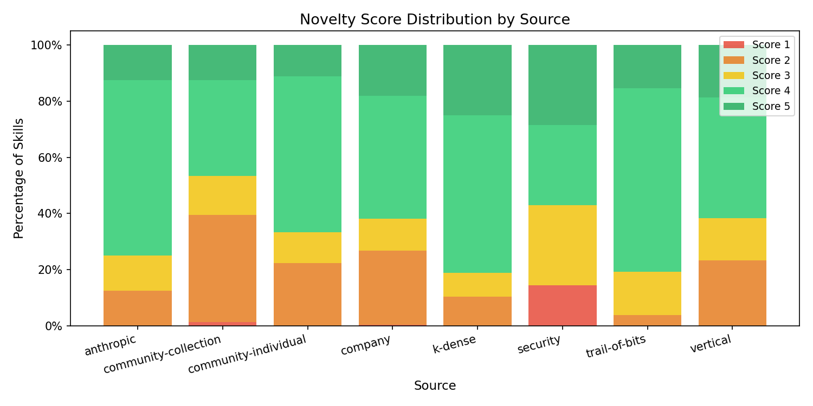

Novelty — the degree to which a skill provides information beyond LLM training data — is the most discriminating dimension in our assessment. It measures whether skills offer genuine value that an agent cannot derive from its existing knowledge, making it arguably the most important quality signal for skill authors.

K-Dense and Trail of Bits lead on novelty, with 81% of their skills scoring 4 or above. These sources focus on specialized domains (scientific computing methodologies, security vulnerability analysis) where proprietary workflows and non-obvious domain knowledge are central. Community collections trail at 47% scoring 4+, reflecting their tendency to wrap well-known libraries and frameworks where the LLM already has strong coverage.

Novelty correlates only weakly with the five craft dimensions (r = 0.06–0.33), confirming that it measures something fundamentally different from writing quality. A skill can be clearly written, well-scoped, and concise (high craft scores) while still conveying information the LLM already knows (low novelty) — a pattern common in community collection skills for popular frameworks.

### Net Negative Risk: Low Novelty Meets High Contamination

Combining LLM-judged novelty with contamination risk scores reveals a concerning pattern: **35 skills (5.2%) across the ecosystem have both low novelty (score ≤ 2) and medium-to-high contamination risk (score ≥ 0.2)**. These skills add mixed-language content that risks interfering with agent code generation while providing little information the LLM does not already possess — a combination where the theoretical net effect on agent performance is negative.

Company-published skills are disproportionately represented: 21 of 288 (7.3%) fall into this "net negative" quadrant. Expanding the threshold to novelty ≤ 3 captures 30 company skills (10.4%). The top offenders are Azure SDK skills — `azure-identity-java`, `azure-security-keyvault-secrets-java`, and similar — with contamination scores above 0.50 but novelty scores of only 2. These are well-documented APIs whose documentation is heavily represented in LLM training data, packaged with multi-language examples that create the structural conditions for language confusion.

Critically, novelty and contamination are statistically independent (r = 0.01 for company skills, r = 0.07 across all skills). There is no natural self-correction where contaminated skills compensate by being more novel. The two risks stack additively: a skill that mixes Python, Java, and TypeScript examples for the same API *and* provides only information the LLM already knows offers the worst of both worlds. Among skills with medium or high contamination, company skills have the lowest mean novelty (3.55) compared to the non-company average (3.73) — they are not making up for contamination risk with informational value.

The theoretical basis for concern is well-established: irrelevant context degrades LLM task performance [@shi2023distracted], mixed-language content causes systematic programming language confusion [@moumoula2025plc], and in-context examples bias generated code toward the patterns they contain [@ali2024copybias]. A skill that introduces these interference risks without contributing novel information is, by this reasoning, strictly worse than no skill at all — the agent pays the contamination cost without receiving informational benefit. Our behavioral evaluation complicates this prediction: novelty amplifies behavioral effects in *both* directions (r = +0.327 for |B-A|), and low-novelty skills actually show smaller degradation than expected — the model appears to largely ignore content it already knows. The real risk is high-novelty skills loaded for mismatched tasks, where the model pays attention to genuinely novel content that happens to be irrelevant to the current task.

## Cross-Contamination Risk

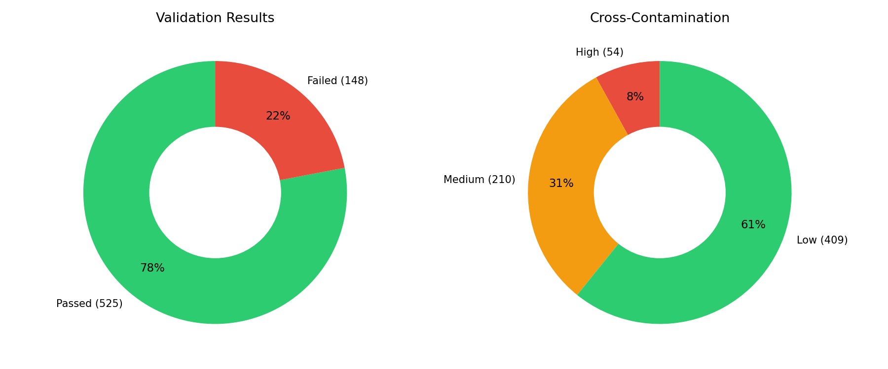

Our cross-contamination analysis identified:

- **10 high-risk skills** (1.5%) — significant structural potential for cross-language interference, driven primarily by application-to-application language mixing
- **147 medium-risk skills** (21.8%) — some multi-language or multi-technology mixing
- **516 low-risk skills** (76.7%) — focused on a single technology or language

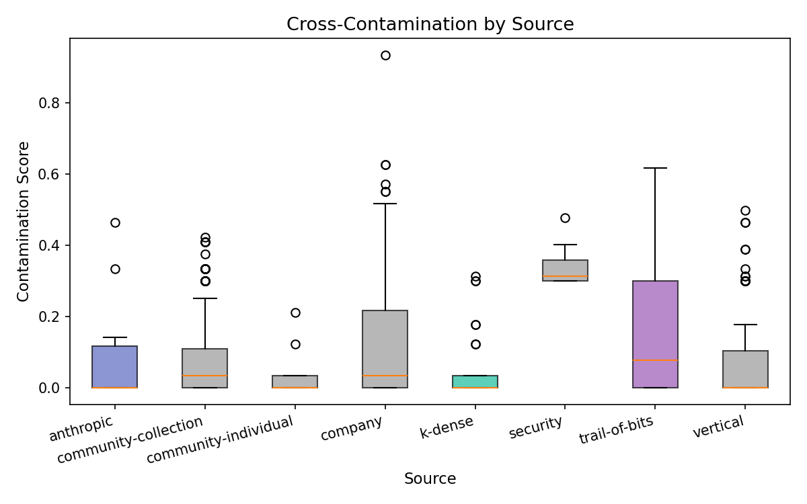

The security category had the highest average risk score (0.344), followed by Trail of Bits (0.151) and company-published skills (0.127). Security tools inherently operate across multiple languages and environments, making this expected. Company skills — particularly those for cloud platforms (Azure, AWS, Terraform) — scored higher because they often cover multiple language SDKs within a single skill.

### High-Risk Skills

The 10 high-risk skills cluster around two primary patterns, with the similarity-weighted scoring concentrating high-risk flags on skills with genuine application-to-application language mixing:

1. **Multi-SDK platform skills** (highest language confusion risk): Azure, AWS, and Terraform skills that cover multiple application language bindings (Python, Java, TypeScript, .NET, Rust) within one skill. These represent the strongest contamination concern because they mix syntactically similar languages for the same API — exactly the pattern that Programming Language Confusion research identifies as most problematic [@moumoula2025plc].
2. **Infrastructure-as-code skills** (moderate risk): Skills mixing shell commands, configuration languages (HCL, YAML), and application code. The language confusion risk here is lower due to syntactic dissimilarity between auxiliary and application languages, though context dilution remains a concern.
3. **Security analysis skills** (mixed risk): Tools that inherently operate across language boundaries, combining both application-to-application mixing (higher risk) and application-to-auxiliary mixing (lower risk).

Key examples:
- **upgrade-stripe** (Stripe, risk: 0.93): Covers SDK upgrades across multiple application languages (Python, Ruby, JavaScript) with mixed code examples — the highest-risk pattern, as examples for the same Stripe API in multiple syntactically similar languages create direct confusion potential
- **copilot-sdk** (Microsoft, risk: 0.63): Multi-SDK skill mixing application languages with shared API patterns
- **provider-resources** (HashiCorp, risk: 0.55): Terraform provider development mixing Go with HCL and shell — the Go application code mixed with infrastructure references drives the score, while the HCL/shell auxiliary mixing is appropriately down-weighted
- **ossfuzz** (Trail of Bits, risk: 0.53): Combines Docker, shell, Python, and C/C++ for fuzz testing — the Python/C++ application language mixing is the primary risk factor

Notably, **monitoring-observability** (DevOps vertical) — previously scored as high-risk (0.72) under uniform weighting — now scores as medium (0.50) because its multi-language content is primarily bash, YAML, and configuration alongside infrastructure tool references, not application-to-application language mixing. This reclassification better reflects the actual language confusion risk.

### Case Study: MongoDB Cross-Contamination

During development of this analysis, we observed an illustrative case of cross-contamination: an unpublished MongoDB skill containing `mongosh` (shell) examples caused Claude Code to generate incorrect Node.js driver code. The agent produced queries using shell syntax instead of the Node.js driver API, and it embedded shell-specific operators in JavaScript contexts.

To validate this observation experimentally, we constructed a controlled A/B eval using a MongoDB Search skill under development by the first author.^[Unlike the published skills analyzed elsewhere in this paper, the MongoDB Atlas Search skill was unpublished at the time of testing. The skill version tested, eval pipeline, task definitions, generation outputs, and scoring results are available at <https://github.com/dacharyc/mdb-skill-builder/tree/main/eval> to enable independent replication. The skill has since been revised based on the contamination findings described here.] Five tasks were generated under baseline (no skill) and with-skill conditions (3 runs each at temperature 0.3, scored by an LLM judge and deterministic pattern matching). Two tasks produced clear contamination signals:

- **Shell syntax in JSON Schema output**: A task requesting a pure JSON Schema document produced `db.` (mongosh shell prefix) references in 0/3 baseline runs but 3/3 with-skill runs — the skill's reference files contain `mongosh` examples that bleed into non-shell output contexts.
- **Invalid JSON constructs in index definitions**: A task requesting valid JSON index definitions produced `ISODate()` function calls (a mongosh-specific construct invalid in JSON) in with-skill runs but not in baseline runs, alongside `//` comments (also invalid in JSON) sourced from the skill's reference examples.

Overall, the skill slightly degraded output quality: baseline averaged 4.37/5.0 across judge dimensions versus 4.25/5.0 with the skill loaded. The model already knows MongoDB Search well from training data — the skill's primary effect was introducing shell-syntax contamination rather than filling knowledge gaps. Notably, the realistic context condition (skill loaded alongside a Claude Code system preamble and simulated conversation history) mitigated the contamination in some tasks — a pattern that generalizes across the broader behavioral evaluation (see Behavioral Validation).

This is consistent with documented LLM behaviors: code LLMs exhibit Programming Language Confusion, systematically defaulting to patterns from syntactically similar languages [@moumoula2025plc], and in-context examples bias the style of generated code toward reproducing the patterns present in the examples [@li2023lail]. The MongoDB case is particularly illustrative because the shell examples are syntactically valid JavaScript (MongoDB's Shell is JavaScript-based), making the interference subtle — the generated code *looks* correct but uses the wrong API for the target context. Research on attention dilution in code generation further suggests that as skill file content grows, the model pays less attention to the user's actual intent [@tian2024spa].

### Illustrative Example: Gemini API Multi-Language Skill

The **gemini-api-dev** skill (Google, risk: 0.55) provides a concrete illustration of the API shape differences that make cross-contamination particularly insidious. The skill demonstrates a single operation — `generateContent` — in four languages, each with a subtly different API shape:

**Python** — keyword arguments, snake_case method:
```python
response = client.models.generate_content(
    model="gemini-3-flash-preview",
    contents="Explain quantum computing"
)
print(response.text)
```

**JavaScript** — options object, camelCase method:
```javascript
const response = await ai.models.generateContent({
  model: "gemini-3-flash-preview",
  contents: "Explain quantum computing"
});
console.log(response.text);
```

**Go** — positional parameters, PascalCase method, explicit context:
```go
resp, err := client.Models.GenerateContent(ctx,
    "gemini-3-flash-preview",
    genai.Text("Explain quantum computing"), nil)
```

**Java** — positional parameters, camelCase method, null config:
```java
GenerateContentResponse response =
    client.models.generateContent(
        "gemini-3-flash-preview",
        "Explain quantum computing",
        null);
System.out.println(response.text());
```

The differences are subtle but consequential: Python uses keyword arguments while Java uses positional parameters; Go wraps content in `genai.Text()` while others pass raw strings; Java accesses the result via a method call (`response.text()`) while Python and JavaScript use a property (`response.text`). An agent working on a Python project but primed with the JavaScript or Go patterns from this skill might generate code using positional arguments, or omit the keyword parameter names — code that would fail at runtime. This is exactly the kind of syntactically plausible but semantically incorrect output that Programming Language Confusion research predicts for syntactically similar languages sharing the same API surface [@moumoula2025plc].

### Behavioral Validation

To test whether structural contamination scores predict actual output degradation, we evaluated 19 skills behaviorally using the methodology described in the Behavioral Evaluation subsection of Methodology. The central finding: **structural contamination scores do not predict behavioral degradation** (r = 0.077, n = 19). Skills with high structural risk scores do not consistently produce worse output than skills with low scores.


The behavioral eval does find real degradation — mean B-A delta is -0.080 across 19 skills, with 6 skills reaching statistical significance (p < 0.05) — but the degradation is driven by content-specific mechanisms rather than the structural language-mixing patterns our contamination heuristic measures. The disconnect is stark in individual cases: **upgrade-stripe** (highest structural risk at 0.93) shows only modest behavioral degradation (B-A = -0.117, not significant), while **react-native-best-practices** (structural risk 0.07, the second-lowest in our sample) produces the largest degradation (B-A = -0.384, p = 0.001).

### Content Interference Mechanisms

Examining the degradation patterns across all 19 skills reveals that cross-language code confusion — the mechanism our structural scoring was designed to detect — is only one of several interference vectors. We identified six distinct mechanisms:

1. **Template propagation**: A skill's output templates are reproduced verbatim in unrelated contexts. The **claude-settings-audit** skill (B-A = -0.483, p = 0.019) contains `// comments` in JSON output templates; the model faithfully reproduces this invalid JSON syntax across all tasks. The contamination is format-level, not language-level.

2. **Textual frame leakage**: A skill's identity bleeds into output prose without affecting code correctness. **react-native-best-practices** outputs include phrases like "following React Native best practices for native iOS code" in tasks requesting pure Swift or Kotlin — the skill's framing contaminates the explanation even when the code is clean. This is scored as degradation by both the LLM judge and human review, but is a different phenomenon than language confusion.

3. **Token budget competition**: Skill content causes the model to generate longer outputs that hit token limits, truncating implementations. This takes two forms: in the react-native case, with-skill outputs spend 2.6× more tokens on explanatory prose and 18% fewer on code compared to baseline. In the **provider-resources** case (B-A = -0.317, p = 0.010), the skill's detailed Go patterns cause the model to generate 2× longer implementations — adding full import blocks, extra struct fields, and elaborate helper functions — that hit the 4,096-token ceiling mid-function. Baseline outputs for the same task use ~1,800 tokens and complete successfully; with-skill outputs expand to ~3,900 tokens and are truncated.

4. **API hallucination**: The model invents plausible but nonexistent API methods after seeing similar APIs in skill content. **upgrade-stripe** (B-A = -0.117) generates fabricated Stripe SDK methods that follow the naming conventions in the skill's examples but do not exist. Unlike language confusion, the hallucinated code is in the *correct* language — it is the API surface that is wrong.

5. **Cross-language code bleed**: The classic Programming Language Confusion mechanism — shell syntax appearing in JavaScript output (MongoDB case study), mongosh operators in JSON contexts. This is the only mechanism our structural scoring is designed to detect, and it does predict it: the MongoDB skill's structural score correctly flags the risk. But across 19 skills, this mechanism accounts for a minority of the total degradation observed.

6. **Architectural pattern bleed**: A skill's design-level patterns transfer across languages without any syntax errors. The provider-resources skill teaches Go Terraform provider conventions (separate models, client abstractions, test directories); when the model is asked to write a Python Pulumi provider, it generates an over-engineered 7-file project structure instead of a single-file implementation, consuming tokens on scaffolding before reaching the core task. The judge flags this as "enterprise Java/C# patterns" — the Go architecture doesn't manifest as Go *syntax* in Python (which would be classic language confusion) but as inappropriate *structural* complexity. This is the subtlest mechanism we observe: the output is syntactically correct in the target language, but the design is contaminated.

These mechanisms have different implications for skill authors. Template propagation and API hallucination are addressable through content review (fix invalid syntax in templates, avoid suggestive API patterns). Textual frame leakage, token budget competition, and architectural pattern bleed are harder to mitigate because they emerge from the skill's identity, scope, and structural conventions rather than specific content defects.

### Case Study: react-native-best-practices

The **react-native-best-practices** skill is the most instructive case because it produces the largest behavioral degradation (B-A = -0.384) despite having essentially zero structural contamination risk (0.07). The skill's 281 code blocks are 94% language-labeled, spanning 8 application languages (C++, JavaScript, JSX, Kotlin, Objective-C, Swift, TSX, TypeScript). By every structural metric, it should be well-organized.

The degradation comes from two interacting mechanisms. First, textual frame leakage: the skill's React Native framing appears in output prose for tasks that have nothing to do with React Native. A task requesting a native iOS media player in Swift receives an introduction referencing "React Native best practices for native iOS development." A task requesting a Kotlin Android service references "React Native's threading model." The code itself is largely correct — it is the surrounding explanation that is contaminated.

Second, token budget competition: with the skill loaded, outputs allocate substantially more tokens to explanatory commentary and less to code. Under the eval's 4,096-token output ceiling, this means with-skill outputs produce less complete implementations than baseline outputs for the same tasks.

A revealing contrast is **sharp-edges** (Trail of Bits): 12 distinct application languages, 282 code blocks, 100% language-labeled, structural contamination score 0.62 — yet only -0.083 B-A delta. The difference is content type, not language count. sharp-edges teaches security vulnerability patterns that are conceptually portable across languages (buffer overflows look similar in C, C++, and Rust). react-native-best-practices teaches framework-specific implementation patterns (FlashList, Turbo Modules, threading models) tightly bound to specific platforms. The security patterns don't interfere; the framework patterns do.

### Realistic Context Mitigates Most Interference

The most practically significant finding is that realistic context — a system preamble plus simulated conversation history, approximating how skills are actually loaded in agentic workflows — substantially attenuates interference. Mean D-A delta (realistic minus baseline) is -0.029, compared to mean B-A delta of -0.080. The mean mitigation ratio is -67.8%: realistic context eliminates roughly two-thirds of the skill-only degradation on average.

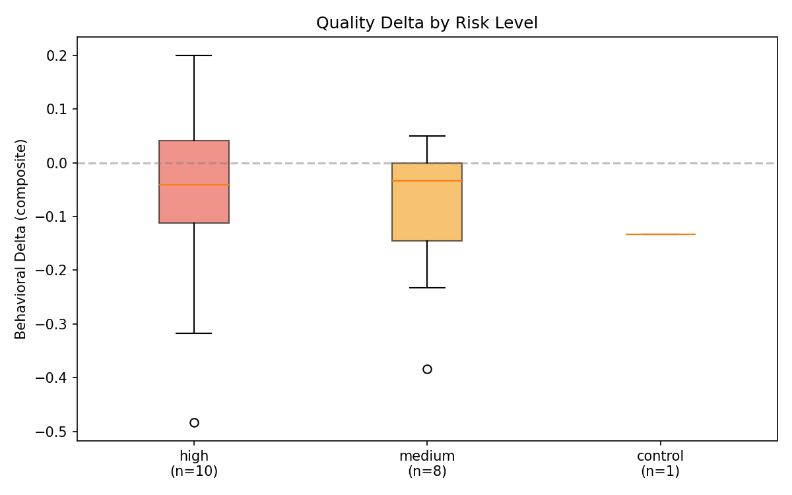

This mitigation is consistent across most skills but not universal, and its effectiveness depends on the mechanism. **upgrade-stripe** is the starkest exception: its D-A delta (-0.500) is *worse* than its B-A delta (-0.117), meaning realistic context amplifies rather than mitigates the interference. The mechanism is API hallucination — in realistic context, the system preamble's emphasis on using available tools and being helpful appears to reinforce the model's tendency to generate plausible-but-fabricated Stripe API methods. **provider-resources** shows an asymmetry within the same skill: cross-language interference (Go patterns in Python output) is fully mitigated by realistic context, but same-language over-specification (Go patterns in a different Go task) shows only 22% mitigation. When the skill's patterns are in the same language as the task, the model has less reason to discard them.

For skill authors and platform maintainers, this finding is reassuring: the degradation measured under the artificial skill-only condition (B) substantially overestimates the interference that users experience in practice. Skills are not loaded in isolation — they compete with a rich context that anchors the model's behavior.

### What Predicts Behavioral Degradation

If structural contamination scores don't predict degradation, what does? Our analysis identifies several weak predictors, but no single structural metric provides a reliable signal.

**Novelty amplification.** The strongest predictor of degradation *magnitude* is the skill's novelty score (r = +0.327 for |B-A|). High-novelty skills produce larger behavioral effects in both directions — they help more on tasks they're designed for and hurt more on tasks they're not. This is consistent with the model paying more attention to genuinely novel content: novel skills are "louder" in the context window. The direction of the effect depends on task type: on cross-language tasks, higher novelty correlates with worse degradation (r = -0.328); on similar-syntax and adjacent-domain tasks, novelty correlates with improvement (r = +0.287, +0.289).

**Task type.** Degradation is concentrated on grounded tasks (mean B-A = -0.193) and cross-language tasks (mean B-A = -0.171), while direct-target and adjacent-domain tasks show near-zero mean effect (-0.009 each). Skills tend to help on their intended domain and hurt on domains where the model already performs well without them.

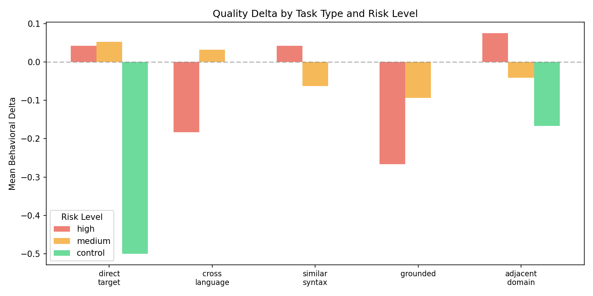

**Negative results.** Several factors we expected to predict degradation do not:

- *Code block language labels*: Skills with 100% language-labeled code blocks show *worse* mean degradation (-0.105) than partially-labeled skills (-0.052), the opposite of what PLC research would predict. Labels address within-context language disambiguation, not the cross-task interference mechanisms we observe.
- *Skill size*: Token overhead correlates weakly with B-A (r = -0.188), but the relationship is confounded by measurement artifacts from selective reference loading.
- *LLM quality dimensions*: No single quality dimension (clarity, actionability, token efficiency, scope discipline, directive precision) predicts B-A (all |r| < 0.25).
- *Structural contamination score*: r = 0.077, essentially zero.

The practical implication is that contamination risk cannot be reduced to a single structural metric. Content specificity (framework-specific patterns vs. language-portable patterns), task mismatch (skill loaded for an unrelated task), and content defects (invalid syntax in templates, suggestive API patterns) matter more than language mixing per se.

## Company vs. Community: Quality Comparison

A key question motivating this expanded analysis was whether company-published skills demonstrate higher quality than community contributions. The answer is nuanced:

| Dimension | Company (288) | Community Collections (167) | Anthropic (16) |
|-----------|--------------|---------------------------|----------------|
| Pass rate | 79.2% | 94.0% | 87.5% |
| Avg tokens | 6,790 | 22,900 | 8,189 |
| Avg info density | 0.266 | 0.174 | 0.148 |
| Avg specificity | 0.585 | 0.579 | 0.725 |
| Avg contamination score | 0.127 | 0.091 | 0.078 |

Companies produce more **informationally dense** skills (higher code-to-prose ratio) but score lower on **structural compliance** (79.2% vs 94.0% for community collections) and **instruction specificity**. This suggests companies prioritize API reference content over the instructional framing that helps agents use the information effectively.

Anthropic's own skills, while small in number, set a benchmark for instruction specificity (0.725) — their skills use strong directive language that leaves less room for agent misinterpretation. Community collections fall between company and Anthropic skills on most dimensions.

## Metric Correlations

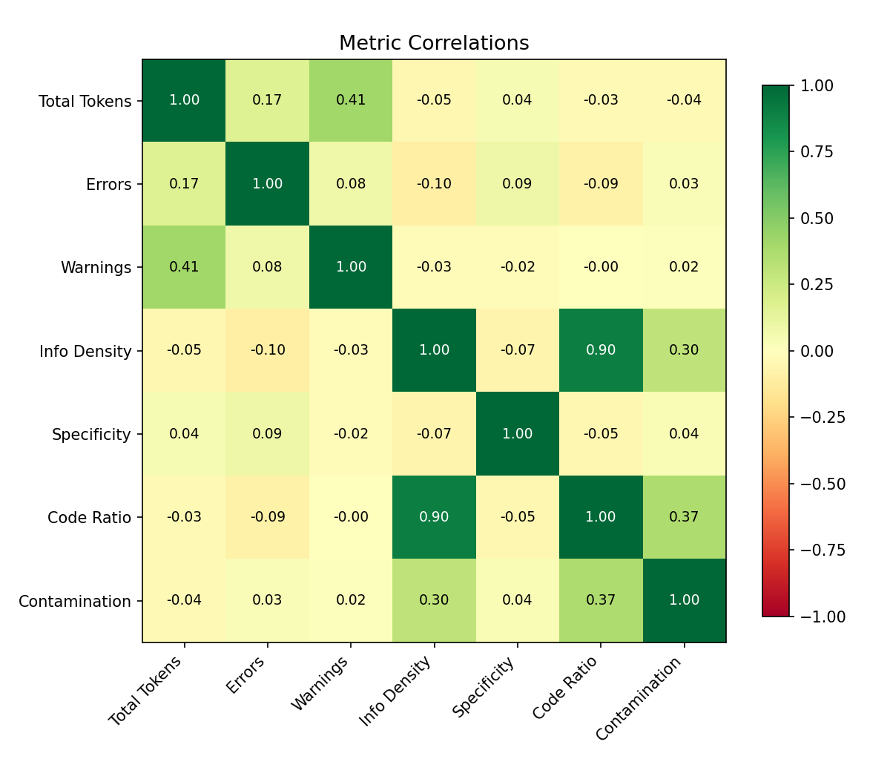

Notable correlations:
- Token count shows weak positive correlation with error count, suggesting larger skills tend to have more structural issues
- Information density and code block ratio are strongly correlated (by construction)
- Risk score correlates with warnings, as structurally complex skills tend to have broader technology scopes

### LLM Dimension Correlations

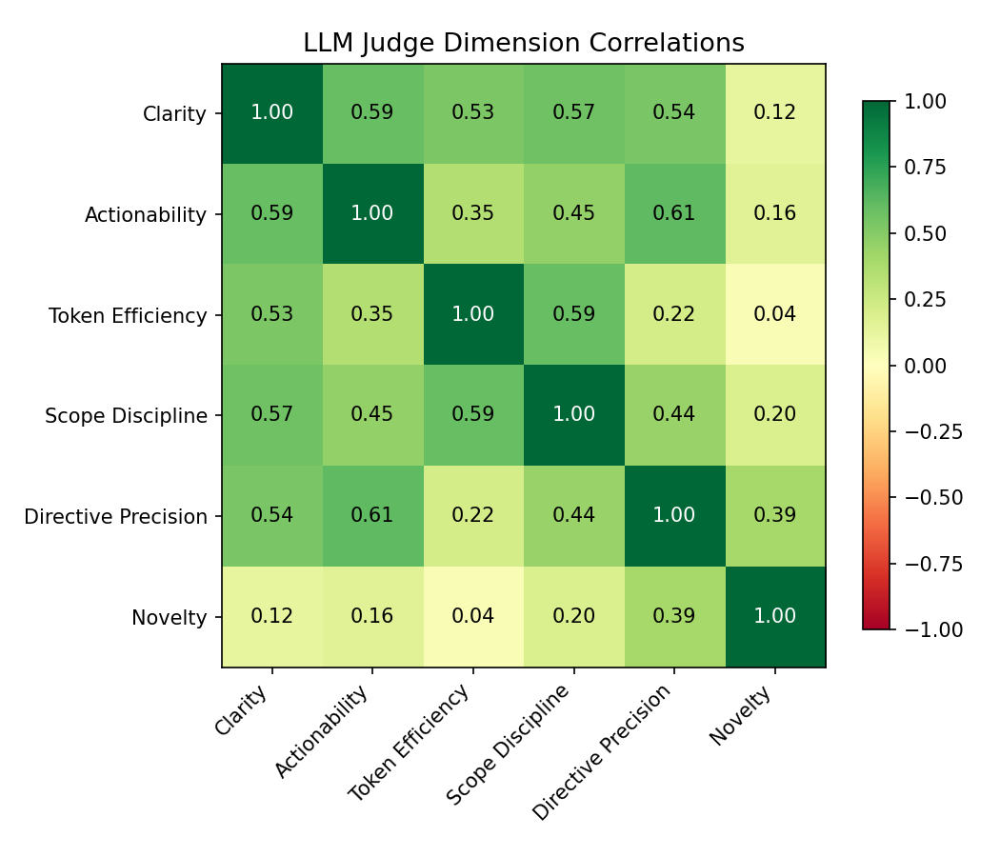

The six LLM judge dimensions form two distinct clusters. The five *craft quality* dimensions — clarity, actionability, token efficiency, scope discipline, and directive precision — intercorrelate at r = 0.40–0.73, forming a coherent quality factor. Novelty stands apart, correlating with craft dimensions at only r = 0.06–0.33. This two-factor structure confirms that novelty captures a genuinely independent quality signal: a skill's writing craft and its information novelty are largely orthogonal.

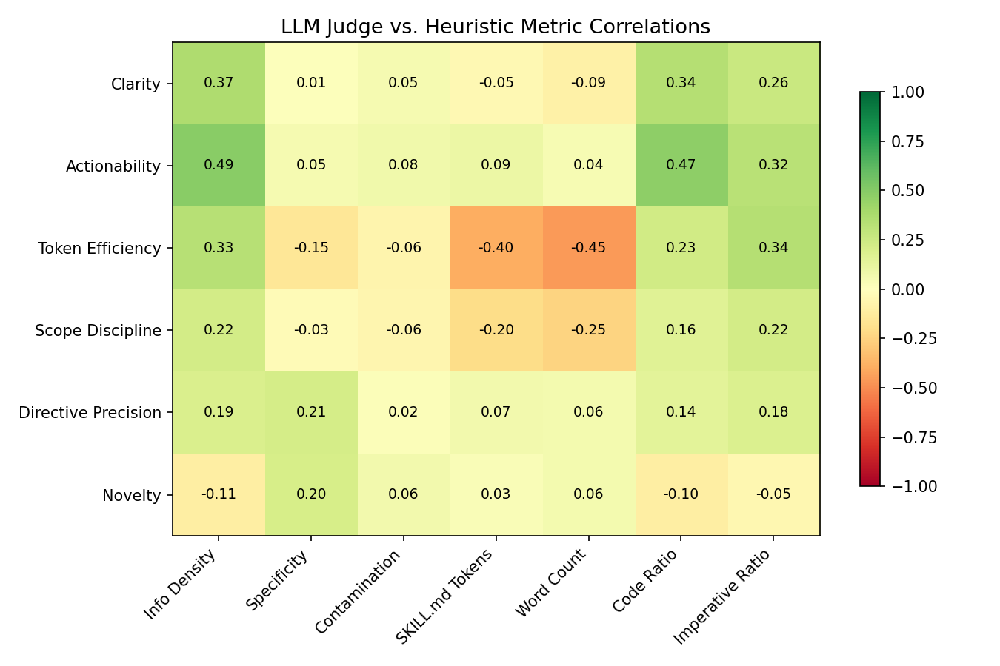

Cross-correlating LLM dimensions with heuristic metrics reveals that information density is the best heuristic predictor of LLM-judged quality (r ≈ 0.50 with actionability), validating our heuristic as a useful proxy. Token efficiency anti-correlates with word count (r ≈ −0.45) — longer skills are penalized by the judge, consistent with the view that verbosity degrades agent performance. Notably, contamination score and novelty are essentially uncorrelated (r ≈ 0.07), confirming that these metrics are complementary rather than redundant: contamination measures *structural* risk from mixed-language content, while novelty measures *informational* value beyond training data.

## Reference File Analysis

Beyond the primary `SKILL.md` file, the agentskills.io specification allows skills to include reference files — supplementary documents placed in a `references/` directory. These files provide additional context (API documentation, code examples, configuration templates) that agents load alongside the skill instructions. Our analysis reveals that reference files represent a significant and underexamined dimension of skill quality.

### Prevalence and Scale

Of 673 skills analyzed, **412 (61%) include reference files**, totaling 1,877 files across the dataset. Reference file usage varies by source: company-published skills and community collections are the heaviest users, while methodology-focused skills (K-Dense) and security skills rarely include references.

### Token Budget Impact

Reference files have a dramatic impact on context window consumption. Among skills with references:

- **81% have more reference tokens than SKILL.md tokens** — the references outweigh the primary instruction file
- The median reference token count is 4,729, but the distribution has a heavy tail: p99 reaches 44k tokens
- **4 skills have reference totals exceeding 50,000 tokens**, prime candidates for context window degradation — controlled experiments show 13.9–85% performance loss as input length increases, even when models can perfectly retrieve all evidence [@du2025context]
- Extreme outliers exist: vueuse-functions (153k reference tokens, 18x the SKILL.md) and security-best-practices (91k reference tokens, 57x the SKILL.md)


These findings have practical implications. Agent platforms typically operate within context windows of 100k–200k tokens, though research suggests that effective context lengths are often less than half the advertised training length due to undertrained positional encodings [@an2025effective]. A single oversized reference file can consume a significant fraction of this budget, potentially crowding out the user's code context and degrading agent performance — an effect documented across 18 state-of-the-art models, where performance degrades non-uniformly as context grows [@hong2025contextrot; @yoran2024robust]. Skill authors should be mindful that reference files are not "free" — they compete directly with the user's code for context window space [@salim2026tokenomics].

### Content Quality

Reference files tend to have **higher information density** than their corresponding SKILL.md files. This is expected: references are typically code-heavy (API examples, configuration templates, type definitions) rather than prose-heavy instruction documents. The higher density reflects their role as reference material rather than instructional content.

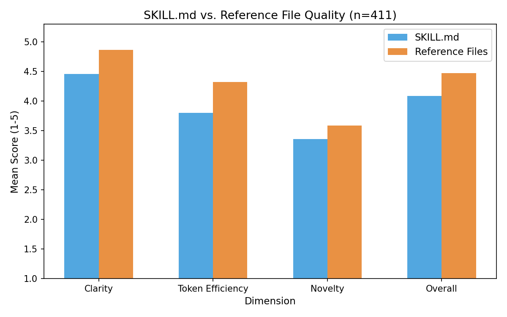

LLM-as-judge scoring confirms and quantifies this pattern. Across 411 skills with both SKILL.md and reference scores, reference files outscore their parent SKILL.md on every shared dimension: +0.39 overall, +0.52 on token efficiency, +0.41 on clarity, and +0.23 on novelty. References are more concise and information-dense — focused code examples and API documentation versus prose instructions — which the LLM judge rewards. The novelty gap is smaller, suggesting that while references contain more *efficiently presented* information, the *uniqueness* of that information relative to training data is only modestly higher than SKILL.md content.

### Contamination Risk and Hidden Contamination

Reference files introduce a distinct contamination vector. Because references often contain code examples for specific language SDKs, they may interfere with the agent's code generation when the user is working in a different language — a concern grounded in research showing that in-context code examples bias generated output toward the patterns present in those examples [@li2023lail; @ali2024copybias]. Our analysis found that reference contamination patterns differ from SKILL.md contamination:

- Reference files are more likely to contain **multiple programming languages** within a single skill, especially for platform SDK skills that provide examples across Python, TypeScript, Java, and .NET
- Skills with contaminated reference files sometimes have clean SKILL.md files — the contamination is hidden in the supplementary material

Among the 412 skills with reference files, contamination scores diverge between the SKILL.md and references in the majority of cases:

- **32.3%** have higher contamination in references than in SKILL.md
- **66.3%** have higher contamination in SKILL.md than in references
- **1.5%** have equal scores

The most concerning pattern is what we term **hidden contamination**: skills where the SKILL.md file scores as low-risk but the reference files carry medium or high contamination. We identified **66 skills** (16.0% of skills with references) exhibiting hidden contamination — 12 with high-risk references and 54 with medium-risk references.

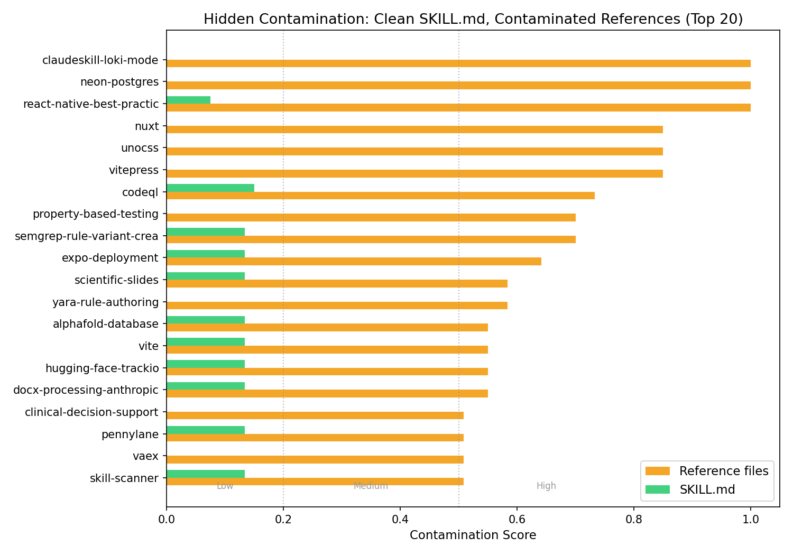

Community collections account for the majority of hidden contamination cases (31 of 66), which is expected given their heavy reliance on reference files (88% adoption rate, averaging 6.9 files per skill). Company-published skills contribute 23 cases, and vertical/domain-specific skills contribute 6.

Illustrative examples of hidden contamination:

- **neon-postgres** (company): SKILL.md contamination 0.00 (low), reference contamination 0.83 (high). The SKILL.md provides clean PostgreSQL-focused instructions, but reference files include examples spanning JavaScript, Python, CSS, TSX, and Bash — with the JavaScript/Python application-language mixing driving the high reference score.
- **react-native-best-practices** (company): SKILL.md contamination 0.07 (low), reference contamination 1.0 (high). Reference files contain code in 14 different languages including Kotlin, Swift, Objective-C, Groovy, and C++ — a mix of application and mobile language categories that produces the maximum contamination score.
- **alphafold-database** (community collection): SKILL.md contamination 0.03 (low), reference contamination 0.21 (medium). Reference files mix Python with Bash and configuration languages for the protein structure prediction pipeline — the similarity-weighted scoring appropriately reduces this from high to medium, as the Python/bash mixing is primarily an auxiliary mismatch.
- **clinical-decision-support** (community collection): SKILL.md contamination 0.00 (low), reference contamination 0.41 (medium). A perfectly clean instruction file is paired with references containing mixed-language code examples.

Hidden contamination has important implications for quality assessment. **Any contamination analysis that examines only the SKILL.md file will miss 66 cases** — a 30% undercount relative to the 223 total skills with medium or high contamination across either their SKILL.md or references. Skill validation tools and quality gates should evaluate reference files alongside the primary instruction file.

### Language Distribution

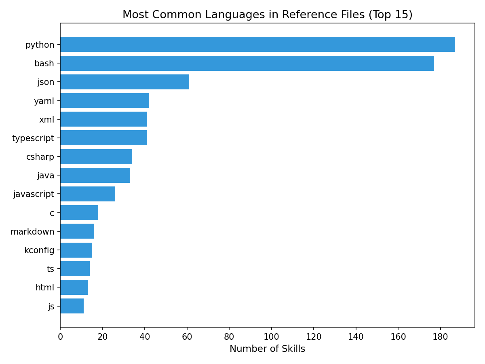

The language distribution across reference files reveals how authors use references in practice. The most common languages reflect the ecosystem's emphasis on web development and cloud platform integration. Shell scripts, configuration languages (YAML, HCL, TOML), and type definition files appear frequently, confirming that references serve as practical implementation guides rather than conceptual documentation.

# Recommendations for Skill Authors

Based on our findings, we organize recommendations into three groups: practices where our data validates existing guidance from the specification maintainer (Anthropic), practices where our data extends that guidance with new specificity, and practices that address dimensions not covered by existing guidance.

## Empirically Validated Existing Guidance

Anthropic's `skill-creator` skill [@anthropic-skill-creator] provides sound authoring principles. Our analysis of 673 skills provides the first ecosystem-wide evidence for how well these principles are followed — and quantifies the consequences when they are not.

1. **Prioritize novel content over restating common knowledge**: Anthropic's skill-creator advises authors to "only add context Claude doesn't already have" and to challenge each piece of information with "Does Claude really need this explanation?" Our data shows the ecosystem largely ignores this guidance: novelty is the weakest dimension across all 673 skills (mean 3.52/5) and the key differentiator between top and bottom skills. Community collection skills score lowest (3.19), precisely because they repackage information already in the model's training data. Skills wrapping well-known libraries should focus on non-obvious gotchas, internal conventions, and project-specific patterns rather than restating standard documentation.

2. **Minimize token usage**: The skill-creator correctly identifies the context window as "a public good" shared with system prompts, conversation history, and user code. Our data quantifies the problem: the median effective skill uses ~5,200 tokens, yet 52% of all tokens ecosystem-wide are nonstandard files (LICENSE texts, build artifacts, XML schemas) that provide no instructional value. Skills exceeding 50,000 tokens likely include material that should be external references or removed entirely.

3. **Delegate depth to reference files**: Anthropic provides detailed progressive disclosure patterns — domain-specific organization, conditional detail loading, and high-level guides with references. Our LLM-as-judge data validates this approach: reference files consistently outscore SKILL.md (+0.39 overall, +0.52 on token efficiency). Keep SKILL.md at 100–300 lines as a concise action guide and delegate detailed examples, API docs, and extended patterns to `references/`. Top-scoring skills use this pattern; bottom-scoring skills either dump everything into SKILL.md or contain nothing but pointers to references.

4. **Audit nonstandard files**: The skill-creator warns against extraneous files (README.md, CHANGELOG.md, etc.). Our analysis reveals the scale of non-compliance: 185 skills (27.5%) contain nonstandard files, inflating mean token counts by 108%. Check that your skill directory contains only `SKILL.md`, `references/`, and `assets/`. Move license text to a reference or remove it; relocate build artifacts and schemas outside the skill directory.

5. **Validate before publishing**: The specification provides validation tools and the skill-creator includes a packaging step that validates automatically. Despite this, 22.0% of published skills fail structural validation — including 21% of company-published skills. Run `skill-validator` on your skill and fix all errors before publishing.

## Extending Existing Guidance with Empirical Specificity

These recommendations build on principles present in Anthropic's guidance but add data-driven specificity not found in the existing documentation.

6. **Use strong directives strategically, not universally**: The skill-creator advises using "imperative/infinitive form." Our analysis refines this: top-scoring skills use strong markers (MUST, ALWAYS, NEVER) at high-consequence decision points — security boundaries, common failure modes, prerequisite checks — not scattered throughout as emphasis for routine instructions. Company skills in particular tend toward advisory language ("consider", "might") where directive language would be more effective, but indiscriminate use of strong directives reduces their signal value.

7. **Write a rich frontmatter description that naturally incorporates keywords**: The specification requires a description field and says it "should include specific keywords that help agents identify relevant tasks." The skill-creator emphasizes it as "the primary triggering mechanism." Our analysis adds a specific recommendation: 50–200 words of natural prose that weaves in relevant keywords organically. Avoid bare keyword lists (`MongoDB, Atlas, Vector Search, embeddings`) — this comma-separated keyword pattern appears in 100 skills across the ecosystem. Explicit trigger phrase lists (`Triggers: "term1", "term2"`) are less harmful when accompanied by substantive prose but still less readable than descriptions that weave keywords naturally into sentences. The skill-creator also correctly notes that "When to Use" information belongs in the description rather than the body, since the body is only loaded after the skill triggers. Body-level scope sections (see recommendation #12) serve a different purpose: helping the agent apply the skill correctly once activated.

## New Recommendations from Empirical Analysis

These practices address dimensions not covered by Anthropic's existing guidance — either entirely new concerns identified by our analysis or structural patterns derived from ecosystem-wide scoring.

8. **Scope skills tightly to avoid content interference**: Skills covering multi-interface tools should target a specific language SDK. A "MongoDB for Node.js" skill is safer than a generic "MongoDB" skill. Our behavioral evaluation found that degradation is driven less by language mixing per se (structural contamination score r = 0.077 vs. behavioral delta) and more by content specificity — framework-specific patterns interfere with unrelated tasks, while language-portable patterns (e.g., security vulnerability patterns across languages) do not. The practical guidance remains the same: tight scoping reduces both language confusion risk [@moumoula2025plc] and the content-specific interference our behavioral eval identifies.

9. **Label code blocks explicitly**: Always specify the language in fenced code blocks (` ```javascript ` rather than ` ``` `). This is good practice for readability and parseability, and research shows explicit language keywords mitigate Programming Language Confusion within a single context [@moumoula2025plc]. However, our behavioral evaluation found no protective effect of language labeling on cross-task interference: skills with 100% label rates showed worse mean degradation (-0.105) than partially-labeled skills (-0.052). Labels address within-context language disambiguation but not the content-specific interference mechanisms (template propagation, textual frame leakage) that dominate in practice.

10. **Separate language-specific examples**: If a skill must cover multiple languages, use clearly delineated sections with explicit context-switching markers. Consider publishing separate skills per language SDK. Our Gemini API case study illustrates how four subtly different API shapes for the same operation create the conditions for syntactically plausible but semantically incorrect code generation.

11. **Favor minimal patterns over comprehensive examples in platform skills**: Enterprise platform skills — SDK guides, provider development frameworks, infrastructure tools — are especially prone to output inflation and architectural pattern bleed. The **provider-resources** skill (HashiCorp) teaches detailed Go Terraform provider conventions through comprehensive code examples; when loaded, the model generates 2× longer implementations that hit token limits and get truncated, and transfers the skill's Go package architecture (separate models, clients, helpers) into Python outputs where a simpler structure would be idiomatic. Similarly, **react-native-best-practices** (Callstack) causes the model to allocate 2.6× more tokens to framework-specific commentary at the expense of code completeness. The practical consequence for enterprise users is twofold: agent-generated code becomes more verbose and complex (increasing maintenance burden), and non-idiomatic architectural patterns bleed across language boundaries (creating technical debt). Platform skill authors should prefer concise pattern summaries over complete implementation examples, and should favor showing the minimal correct pattern for each operation rather than a comprehensive reference implementation. Skills that teach "here is the complete way to build X" are more prone to these effects than skills that teach "here are the key patterns to follow when building X."

12. **Use structured formats over prose**: Top-scoring skills use tables as their primary information vehicle (90% include tables vs. 40% of bottom skills) and maintain roughly a 4:1 ratio of structured content (tables, lists, code) to prose. Quick reference tables near the top of the file, anti-pattern tables, and decision matrices make skills parseable by agents without requiring sequential reading. Every bottom-10 skill in our analysis is prose-heavy. Notably, Anthropic's own skill-creator guidance is itself prose-heavy and does not mention tables as a structural pattern.

13. **Include explicit anti-patterns and negative scope**: Document what NOT to do and why (anti-patterns section), and define what is out of scope (negative scope gate). Of the top 20 skills, 60% include an explicit anti-patterns section and 50% include "When NOT to Use" guidance; both are absent from every bottom-10 skill. Negative guidance is not mentioned in Anthropic's existing authoring documentation.

14. **Follow the empirical template structure**: Our analysis of top-scoring skills reveals a convergent architecture: scope gate → quick reference table → core workflow → domain-specific sections → anti-patterns → troubleshooting → references. We provide a concrete proposed template derived from these patterns (see companion repository). Of the top 20 skills, 80% include a quick reference section near the top; this pattern is absent from every bottom-10 skill and from Anthropic's existing template and guidance.

15. **Validate reference files for contamination**: A clean SKILL.md does not guarantee a clean skill. We identified 66 skills with hidden contamination in reference files — a 30% undercount relative to total contaminated skills if only SKILL.md is analyzed. Run contamination analysis on the full skill directory, not just the instruction file.

16. **Evaluate whether low-novelty skills add value**: Our behavioral evaluation found that novelty amplifies behavioral effects in both directions (r = +0.327 for |B-A|): high-novelty skills help more on matched tasks and hurt more on mismatched tasks, while low-novelty skills have smaller effects overall — the model largely ignores content it already knows. This partially mitigates the "net negative" concern for the 35 low-novelty, medium-to-high contamination skills we identified: they may be less harmful than predicted because the model doesn't attend strongly to redundant content. However, the risk is not zero, and a skill that provides no novel information while consuming context window budget is still inefficient. Before publishing, authors should consider whether the content adds value beyond what the LLM already knows.

# Recommendations for Spec Maintainers

The agentskills.io specification [@agentskills-spec] provides structural requirements (directory layout, frontmatter fields, file organization), and Anthropic's `skill-creator` skill [@anthropic-skill-creator] offers sound authoring principles (context window efficiency, progressive disclosure, novelty over repetition). Our recommendations focus on gaps: areas where the specification and existing guidance are silent, and where our ecosystem-wide data suggests intervention would have the greatest impact.

1. **Add a `languages` frontmatter field**: Skills should explicitly declare which programming languages they target. This enables agents to filter skills by context and would help mitigate cross-contamination. Neither the specification nor the skill-creator currently addresses language scoping.

2. **Define quality tiers with separate craft and novelty axes**: Introduce a quality score based on structural compliance, content metrics, contamination risk, and LLM-judged dimensions. Our analysis reveals a two-factor structure: five craft dimensions (clarity, actionability, token efficiency, scope discipline, directive precision) intercorrelate at r = 0.40–0.73, while novelty is largely independent (r = 0.06–0.33). Quality tiers should reflect both axes — a skill can be well-crafted but unoriginal, or novel but poorly written, and the improvement path is different for each.

3. **Require code block language annotations**: Make unlabeled code blocks a validation error, not just a warning. Language annotations improve readability, enable syntax highlighting, and aid programmatic analysis. Research shows explicit language keywords mitigate Programming Language Confusion within a single context [@moumoula2025plc], though our behavioral evaluation found no protective effect against the cross-task interference mechanisms that dominate in practice (see Behavioral Validation).

4. **Provide multi-language skill guidelines**: Neither the specification nor the skill-creator addresses skills that necessarily cover multiple languages (CI/CD, infrastructure, cross-platform tools). With 10 high-risk and 147 medium-risk skills in our sample, this is an important gap.

5. **Add content interference assessment**: Include cross-contamination detection in the specification's recommended validation pipeline. Our behavioral evaluation shows that structural contamination scores alone do not predict behavioral degradation (r = 0.077), so validation should go beyond language-mixing heuristics to flag content-specific risks: invalid syntax in output templates, framework-specific patterns that may bleed into unrelated contexts, and suggestive API patterns that could trigger hallucination. Critically, this assessment should cover reference files as well as SKILL.md — our analysis found 66 cases of hidden contamination visible only in references.

6. **Engage company publishers on novelty, community authors on craft**: Company-published skills lead on craft quality (scope discipline 4.81, clarity 4.55, token efficiency 4.15) but rank #7 of 8 sources on novelty (3.53) — they are polished documentation for tools the LLM already knows. Community collections show the inverse: weakest on novelty (3.19) but reasonably actionable. The improvement path differs by source: company publishers should focus on non-obvious integration patterns and gotchas rather than restating their public API docs, while community authors would benefit most from structural templates and editorial guidelines to improve craft. The skill-creator's advice to "only add context Claude doesn't already have" is sound but insufficiently emphasized — our data shows it is the most-ignored principle in the ecosystem.

7. **Warn on or penalize nonstandard files**: The skill-creator warns against extraneous documentation files, but the specification itself does not warn against or penalize nonstandard files at the validation level. Currently, 52% of all tokens in the ecosystem come from nonstandard files — including 75.1% of tokens in Anthropic's own skills. A validation warning or error for unexpected root-level files would significantly reduce context window waste. At minimum, agent platforms should consider filtering out nonstandard files when loading skills.

8. **Set token budget guidelines**: The specification recommends "< 5000 tokens" for SKILL.md and the skill-creator says "under 500 lines," but neither provides guidelines for reference files or total skill size. Our analysis shows that the median effective skill is ~4,000 tokens, yet 17 skills exceed 50% of a 128k context window. Guidelines for individual reference files and total skill token budget would help authors understand the practical limits of context window consumption.

9. **Publish a substantive SKILL.md template with structural patterns**: The current official template provides three lines of scaffolding. The skill-creator offers good *principles* (conciseness, progressive disclosure, novelty) but does not prescribe a specific *structure* — it says "write instructions" without specifying which sections to include or in what order. Our analysis of top-scoring skills reveals structural patterns absent from existing guidance that consistently distinguish high-quality skills: quick reference tables (80% of top-20, 0% of bottom-10), anti-pattern documentation (60% of top-20, 0% of bottom-10), negative scope gates, and a convergent section architecture. A template encoding these patterns — with inline guidance explaining *why* each section matters — would operationalize the skill-creator's principles into concrete structure that authors can follow. We provide a proposed template derived from these empirical findings as a companion to this paper.

# Limitations and Future Work

**Limitations:**

- Our content metrics (information density, instruction specificity) are heuristic and may not capture all aspects of skill quality
- Cross-contamination risk scoring measures structural indicators (multi-language content, multi-interface tools, scope breadth) using keyword matching rather than semantic analysis. Our behavioral evaluation of 19 skills confirms that these structural scores do not predict behavioral degradation (r = 0.077) — the actual interference mechanisms are content-specific rather than language-mixing artifacts. The structural scores remain useful as indicators of multi-language complexity but should not be interpreted as behavioral risk predictions
- The scoring weights for language-type mismatches (application-to-application: 1.0, application-to-auxiliary: 0.25, auxiliary-to-auxiliary: 0.1) are informed by the research direction rather than empirically calibrated. Our behavioral evaluation suggests that the weighting scheme captures the wrong dimension: content specificity and task mismatch matter more than language similarity for predicting interference
- The behavioral evaluation covers 19 skills (a 2.8% sample) with 5 tasks each, evaluated at temperature 0.3 with 3 runs per condition. While this provides statistical power for individual skill effects, the sample is too small for robust cross-skill correlations. All correlations reported (e.g., novelty vs. |B-A|, contamination vs. B-A) are exploratory and should be interpreted cautiously
- The behavioral eval uses a fixed 4,096-token output ceiling. For complex tasks where both baseline and with-skill outputs approach this limit, the ceiling creates a confound: token budget competition between skill-influenced commentary and code may overstate degradation relative to unconstrained generation
- For skills with large reference directories, the behavioral eval loads 2–3 reference files per task rather than all references. This selective loading was necessary to avoid measurement artifacts (loading all references produced near-identical outputs, effectively reducing n to 1), but means the eval tests a curated subset of each skill's content rather than the full skill as a user would encounter it
- Skills that contain embedded AI-directed prompts or evaluation rubrics pose a distinct quality risk beyond token waste or contamination: they can act as unintentional prompt injections when loaded into an agent's context window. We observed this directly during LLM-as-judge scoring, where three skills consistently caused the judge model to abandon its evaluation task. A meta-skill containing realistic pressure scenarios (e.g., "Choose A, B, or C. Be honest." and "Make agent believe it's real work, not a quiz") caused the judge to role-play the embedded scenarios rather than evaluate the document. A diagram generation skill with an embedded quality rubric (scoring criteria like "Scientific Accuracy (0-2 points)" and example output showing "SCORE: 8.0") caused the judge to adopt that rubric format instead of its own. Reference files with code-heavy content — particularly C# examples containing curly-brace initializers, inline JSON schemas, and string interpolation — consistently corrupted the judge's JSON output formatting, producing syntactically invalid responses. While an agent performing a user-directed task has a richer context that provides more insulation than a single-purpose judge, the risk is not zero — particularly for skills containing embedded evaluation criteria, example dialogues, or dense code with JSON-like syntax. These three failure modes — prompt hijacking via embedded scenarios, format hijacking via embedded rubrics, and output corruption via code-heavy content — represent categories of skill content that structural validation cannot detect but that skill authors should be aware of
- The dataset represents a point-in-time snapshot; the ecosystem evolves rapidly
- Some skill name collisions occur across sources within the same category

**Future work:**

- **Broader behavioral coverage**: Our behavioral evaluation of 19 skills demonstrates that structural contamination scores do not predict behavioral degradation and identifies six distinct content interference mechanisms. Expanding behavioral testing to a larger sample — particularly targeting the 35 "net negative" skills with low novelty and high contamination — would strengthen the cross-skill correlations and test whether low-novelty skills truly produce smaller effects than high-novelty skills, as our preliminary data suggests
- **Calibrating structural risk scores**: The disconnect between structural contamination scores and behavioral impact (r = 0.077) suggests that the scoring heuristic should be revised. Future work could develop content-specific risk indicators based on the mechanisms identified in our behavioral evaluation: template defect density, framework-specificity measures, and API pattern diversity
- **Longitudinal analysis**: Track skill quality trends as the ecosystem matures and companies update their skills
- **Skill composition analysis**: Study how multiple active skills interact and potentially conflict. Our behavioral eval tests skills in isolation; in practice, agents may load multiple skills simultaneously, creating interaction effects that single-skill testing cannot detect
- **Expanded coverage**: Our ecosystem survey (Appendix A) identifies 800+ additional skills; analyzing the full set would strengthen statistical power

# Conclusion

The Agent Skills ecosystem is young and growing rapidly. Our analysis of 673 skills from 41 repositories reveals meaningful variation in structural compliance (78.0% pass rate), content quality, cross-contamination risk (10 high-risk skills), and context window efficiency (52% token waste). Company-published skills — from Microsoft, OpenAI, Stripe, and others — have a *lower* structural compliance rate (79.2%) than community collections (94.0%), inverting the assumption that official sources produce higher-quality skills.

Three findings stand out as particularly significant. First, the context window waste problem: over half of all tokens loaded from skills are nonstandard files — LICENSE texts, build artifacts, XML schemas, benchmark data — that provide no instructional value to the agent. This is both the largest quality issue by magnitude and the easiest to fix. Second, hidden contamination in reference files: 66 skills appear clean when only the SKILL.md is analyzed but carry medium or high contamination risk in their reference files, meaning contamination assessments that ignore references undercount risk by 30%.

Third, and most consequential for the field: **structural contamination scores do not predict behavioral degradation**. Our behavioral evaluation of 19 representative skills found essentially zero correlation (r = 0.077) between our structural risk heuristic and measured output quality changes. The interference mechanisms that actually degrade output — template propagation, textual frame leakage, API hallucination, and token budget competition — are content-specific rather than language-mixing artifacts. A skill with near-zero structural risk (react-native-best-practices, score 0.07) produced the largest behavioral degradation (B-A = -0.384), while a skill with 12 application languages and 100% code block labeling (sharp-edges, score 0.62) showed minimal effect (-0.083). This disconnect suggests that the field's focus on multi-language mixing as the primary contamination vector — grounded in PLC research [@moumoula2025plc] — captures only one mechanism among several, and not necessarily the most impactful one in the skill context.

The most reassuring finding is that realistic agentic context — a system preamble plus conversation history — mitigates roughly two-thirds of the measured skill-only degradation. Skills are not loaded in isolation, and the rich context of an agentic workflow substantially anchors the model's behavior.

LLM-as-judge scoring across all 673 skills reveals that novelty — the degree to which a skill provides information beyond training data — is the key quality differentiator, correlating only weakly (r = 0.06–0.33) with craft dimensions like clarity and conciseness. Novelty also amplifies behavioral effects in both directions: high-novelty skills help more on matched tasks and hurt more on mismatched tasks. The practical implication is that novelty is both the primary value proposition of skills and the primary risk factor — the same property that makes a skill useful also makes it potentially disruptive when loaded for the wrong task.

Quality standards, validation tooling, and authoring guidelines can address these issues. The behavioral findings suggest that validation should shift from structural language-mixing heuristics toward content-specific checks: template syntax validation, framework-specificity assessment, and reference file scope analysis. As skills become a core part of the AI development workflow, the community benefits from treating them as first-class software artifacts deserving of the same quality discipline we apply to libraries and APIs.

\newpage

# Appendix A: Ecosystem Survey {.unnumbered}

Beyond the 673 skills we analyzed in depth, we conducted a broad survey of the Agent Skills ecosystem to estimate the total scope and identify patterns in adoption. This appendix documents our findings.

## Scale of the Ecosystem

As of February 2026, we identified **120+ repositories** containing Agent Skills, with an estimated **1,400+ individual skills** across the ecosystem. The agentskills.io specification is supported by **27+ agent platforms**.

Our analyzed sample of 673 skills represents approximately 48% of the estimated total. The quality patterns we observe — particularly the 22.0% structural failure rate and 1.5% high contamination risk — likely extend to the broader ecosystem.

## Adoption by Category

**Platform publishers** (3 repos, ~50 skills): Anthropic (16 skills), OpenAI (32 skills for Codex), Vercel (5 skills). These serve as reference implementations.

**Company-published** (22+ repos, ~300+ skills): The largest segment. Microsoft alone publishes 143 skills covering Azure SDKs across five languages. Other major publishers include Sentry (16), HashiCorp (13), WordPress (13), Expo (9), Hugging Face (9), Cloudflare (9), and Vue.js (8). Companies publish skills to reduce integration friction for developers using their products.

**Community collections** (10+ repos, ~400+ skills): Multi-skill repositories from community maintainers. K-Dense-AI publishes 145+ scientific computing skills. Anthony Fu maintains 17 skills for the Vue/Nuxt/Vite ecosystem. Obsidian's CEO publishes 5 skills for the knowledge management tool. The K-Dense/Superpowers family covers development methodology.

**Individual community skills** (60+ repos, ~100+ skills): Single-purpose skills covering niche use cases: D3.js visualization, Playwright testing, ffuf security scanning, Home Assistant automation, video editing, and more.

**Security-focused** (5+ repos, ~65+ skills): Trail of Bits (52+ skills) dominates this space with vulnerability scanning, fuzzing, and audit skills. Prompt Security (7 skills) and Cisco AI Defense provide security scanning skills. Snyk publishes an agent security scanner.

**Vertical/domain-specific** (10+ repos, ~100+ skills):

- *Legal* (lawvable): 38 skills for contract review, compliance, and legal document drafting
- *Biotech* (Adaptyv Bio): 21 skills for protein design, AlphaFold, and computational biology
- *Embedded/IoT* (Zephyr): 21 skills for RTOS development, BLE, and board bringup
- *DevOps*: 6 skills for Terraform, Kubernetes, CI/CD, and monitoring
- *Business strategy* (wondelai): 25 skills covering Blue Ocean Strategy, Design Sprint, and similar frameworks

## Ecosystem Infrastructure

Several supporting tools have emerged:

- **skills.sh**: Web registry with 58,000+ installations, providing search and discovery
- **Vercel `npx skills` CLI**: One-command installation of skills from any GitHub repository
- **SkillsMP**: Marketplace with quality indicators and category filtering
- **skill-validator** [@skill-validator]: Structural validation tool (used in this analysis)
- **Cisco AI Defense skill-scanner**: Security scanner for detecting malicious skill patterns
- **Snyk agent-scan**: Security scanner for AI agents and skills

## Implications for Our Findings

If the quality patterns we observe in our 673-skill sample hold across the full 1,400+ skill ecosystem:

- **~308 skills** may fail structural validation
- **~21 skills** may have structural indicators of high cross-contamination risk
- **~305 skills** may have structural indicators of medium contamination risk

These estimates underscore the urgency of quality standards and validation tooling. The ecosystem has reached a scale where manual review is impractical — automated quality gates are necessary.

## Source Repositories Not Included in Primary Analysis

For completeness, we list additional repositories identified during our survey that were not included in our primary analysis. These represent opportunities for future expansion:

- **OthmanAdi/planning-with-files** (13,888 stars): 13 planning workflow skills
- **blader/humanizer** (4,798 stars): AI text humanization
- **antfu/skills** (3,403 stars): Vue/Nuxt ecosystem (partially included)
- **blader/Claudeception** (1,624 stars): Autonomous skill extraction
- **CharlesWiltgen/Axiom** (465 stars): 144 Apple xOS development skills
- **daymade/claude-code-skills** (579 stars): 37 production-ready skills
- **Aaronontheweb/dotnet-skills** (327 stars): 33 .NET ecosystem skills
- **wondelai/skills** (104 stars): 25 business strategy skills
- **sundial-org/skills** (142 stars): 11 research-oriented skills
- Multiple awesome-lists curating 300-800+ skills each

# References
